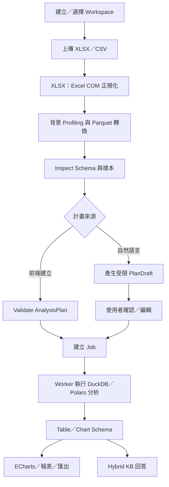

## 文件版本入口

- 給工程師、管理員與測試人員：[FastAPI Human Guide](FastAPI_Human_Guide.md)
- 給前端串接檔案與分析流程：[Frontend File Upload Guide](Frontend_File_Upload_Guide.md)
- 給 LLM、Agent 與程式碼產生器：[FastAPI LLM Reference](FastAPI_LLM_Reference.md)
- 本文件保留詳細設計與歷史範例；執行時契約以 `GET /openapi.json` 為準。

---

# 文件二：FastAPI API 規格書

> 適用分支：`codex/session-analysis-workspace`；API 版本：`0.13.0`；
> 更新日期：2026-07-30。
>
> LLM / agent 讀取入口：本文件描述語意與生命週期；執行時的機器可讀 schema 為
> `GET /openapi.json`。所有 UUID 均使用 RFC 4122 字串，所有未列出的欄位都應視為不支援。

## 1. API 設計原則

1. API version 使用 `/api/v1`。
2. 使用 JSON 作為主要資料格式。
3. 文件上傳使用 `multipart/form-data`。
4. 後端從 token 或 header 解析使用者資訊，不應完全相信 request body 的 user_id。
5. 所有問答請求都必須寫入 audit log。
6. 所有文件檢索都必須經過權限檢查。
7. 所有 LLM 請求前都必須通過 DLP / masking。
8. API 回應需包含 request_id，方便追蹤問題。

---

## 2. API 分類

| 分類              | Prefix                    | 說明     |
| --------------- | ------------------------- | ------ |
| Health          | `/api/v1/health`          | 系統健康檢查 |
| Chat            | `/api/v1/chat`            | 問答相關   |
| Code Chat       | `/api/v1/code-chat`       | 程式碼問答 |
| Documents       | `/api/v1/documents`       | 文件管理   |
| Workspaces      | `/api/v1/workspaces`      | 分析資料持久歸屬與分享 |
| Analysis        | `/api/v1/analysis`        | XLSX／CSV 確定性分析 |
| Skills          | `/api/v1/skills`          | Skill 管理 |
| Knowledge Bases | `/api/v1/knowledge-bases` | 知識庫管理  |
| Permissions     | `/api/v1/permissions`     | 權限設定   |
| Audit           | `/api/v1/audit`           | 稽核紀錄   |
| Admin           | `/api/v1/admin`           | 系統管理   |

---

## 3. 共用 Header

```http
Authorization: Bearer <token>
X-Request-ID: <uuid>
```

若前端使用內部 token，後端需驗證 token signature 或與前端 auth service 交換使用者資訊。

---

## 4. Health API

### 4.1 Health Check

```http
GET /api/v1/health
```

Response:

```json
{
  "status": "ok",
  "service": "ai-agent-api",
  "version": "0.1.0"
}
```

### 4.2 Dependency Check

```http
GET /api/v1/health/dependencies
```

Response:

```json
{
  "status": "ok",
  "postgres": "ok",
  "redis": "ok",
  "embedding_service": "ok",
  "llm_service": "ok"
}
```

---

## 5. Document API

### 5.0 查詢支援格式

```http
GET /api/v1/documents/formats
Authorization: Bearer <token>
```

Response 中的 `items` 是唯一格式清單來源，前端使用 `accept` 設定檔案選擇器：

```json
{
  "items": [
    {"extension": ".pdf", "file_type": "pdf", "category": "pdf"},
    {"extension": ".docx", "file_type": "docx", "category": "office"},
    {"extension": ".md", "file_type": "md", "category": "text"},
    {"extension": ".json", "file_type": "json", "category": "structured"}
  ],
  "accept": ".pdf,.png,.jpg,.jpeg,.tif,.tiff,.bmp,.webp,.docx,.xlsx,.pptx,.txt,.md,.markdown,.log,.csv,.json,.yaml,.yml,.html,.htm,.xml"
}
```

新增格式的位置為 `app/utils/file_utils.py::UPLOAD_TYPE_GROUPS`；新類別還必須在
`DocumentIngestionService._process_document()` 註冊對應 parser。文字與結構化格式由
`app/services/text_document_parser_service.py` 處理。

PDF 上傳僅建立文件與處理工作；需要獨立啟動
`python -m app.workers.document_tasks`。PDF 處理不在 FastAPI/Uvicorn 行程內執行，並預設
限制檔案為 50 MB、200 頁、單頁 20 秒、整體 10 分鐘。只有無可擷取文字的 PDF 才會整份
OCR；PDF 圖片擷取與圖片 OCR 預設關閉，可由 `PDF_IMAGE_*` 環境設定開啟並限制數量。

DOCX／XLSX／PPTX 由 Windows worker 先以 pywin32 呼叫 Word／Excel／PowerPoint
唯讀開啟，再另存短期 OpenXML 副本供 MarkItDown、OpenXML parser 或 openpyxl 使用；
原檔不修改，暫存處理後刪除。兩個 Office-capable worker 的帳號必須具有公司
Purview/AIP/RMS 解密與另存權限。

---

### 5.1 上傳文件

```http
POST /api/v1/documents/upload
```

Content-Type:

```text
multipart/form-data
```

Request fields:

| 欄位                 | 型別     | 必填 | 說明                           |
| ------------------ | ------ | -- | ---------------------------- |
| file               | file   | 是  | 以 `GET /documents/formats` 回傳清單為準 |
| scope              | string | 否  | `knowledge_base`（預設）或 `session` |
| knowledge_base_id  | UUID   | 條件式 | `scope=knowledge_base` 時必填      |
| session_id         | UUID   | 否  | `scope=session` 時可填；省略則建立新 Session |
| chat_type          | string | 否  | `general`（預設）或 `code` |
| confidential_level | string | 是  | 文件分級                         |
| department         | string | 否  | 所屬部門                         |
| document_type      | string | 否  | paper / report / sop / image |
| version            | string | 否  | 文件版本                         |

Response:

```json
{
  "request_id": "req-001",
  "document_id": "doc-001",
  "status": "uploaded",
  "scope": "session",
  "knowledge_base_id": null,
  "session_id": "2ecaed2e-49e5-4b95-b14c-438ef177b233",
  "message": "Document uploaded and queued for background processing."
}
```

Scope 規則（互斥）：

- `knowledge_base`：必須傳 `knowledge_base_id`，不得傳 `session_id`。
- `session`：不得傳 `knowledge_base_id`；`session_id` 省略時由伺服器建立並回傳。
- Session 文件不會出現在任何知識庫或 LLMWiki 中，只能由相同 `session_id` 的 Chat 請求檢索。
- 一般使用者只能使用自己擁有的 Session；管理員可維運所有 Session。
- 上傳成功僅代表已排入處理；前端必須輪詢文件狀態至 `ready` 後再送入問答。
- 多檔 Session 上傳時，先取得第一檔回傳的 `session_id`，其餘檔案再帶入相同 ID。

---

### 5.2 查詢文件列表

```http
GET /api/v1/documents
```

Query Parameters:

| 參數                 | 型別     | 必填 | 說明     |
| ------------------ | ------ | -- | ------ |
| knowledge_base_id  | string | 否  | 知識庫 ID |
| status             | string | 否  | 文件狀態   |
| confidential_level | string | 否  | 文件分級   |
| page               | int    | 否  | 頁碼     |
| page_size          | int    | 否  | 每頁筆數   |

Response:

```json
{
  "items": [
    {
      "document_id": "doc-001",
      "filename": "paper.pdf",
      "title": "Defect Detection Review",
      "status": "ready",
      "confidential_level": "internal",
      "page_count": 12,
      "created_at": "2026-07-04T10:00:00"
    }
  ],
  "page": 1,
  "page_size": 20,
  "total": 1
}
```

---

### 5.3 查詢文件狀態

```http
GET /api/v1/documents/{document_id}/status
```

Response:

```json
{
  "document_id": "doc-001",
  "status": "embedding",
  "progress": 72,
  "message": "Embedding chunks 120/168"
}
```

---

### 5.4 查詢文件詳細資訊

```http
GET /api/v1/documents/{document_id}
```

Response:

```json
{
  "document_id": "doc-001",
  "filename": "paper.pdf",
  "title": "Defect Detection Review",
  "scope": "knowledge_base",
  "knowledge_base_id": "kb-001",
  "session_id": null,
  "language": "en",
  "confidential_level": "internal",
  "department": "R&D",
  "status": "ready",
  "page_count": 12,
  "chunk_count": 85,
  "created_at": "2026-07-04T10:00:00"
}
```

---

### 5.5 重新索引文件

```http
POST /api/v1/documents/{document_id}/reindex
```

Response:

```json
{
  "request_id": "req-002",
  "document_id": "doc-001",
  "status": "queued",
  "message": "Reindex task has been queued."
}
```

---

### 5.6 封存文件

```http
POST /api/v1/documents/{document_id}/archive
```

Response:

```json
{
  "document_id": "doc-001",
  "status": "archived"
}
```

---

### 5.7 更新文件 Metadata

```http
PATCH /api/v1/documents/{document_id}
Content-Type: application/json
```

可更新 `title`、`language`、`confidential_level`、`department`、`source_type` 與
`version`。呼叫者需要文件 write 權限；回覆為完整 `DocumentDetail`。

### 5.8 刪除文件

```http
DELETE /api/v1/documents/{document_id}
```

呼叫者需要文件 manage 權限。成功回傳 `204 No Content`，並清除文件、處理工作、
切片、圖片、權限資料與本機 artifact。

---

## 6. Knowledge Base API

### 6.1 建立知識庫

```http
POST /api/v1/knowledge-bases
```

Request:

```json
{
  "name": "Literature Knowledge Base",
  "description": "Factory literature and research papers",
  "owner_department": "R&D",
  "default_confidential_level": "internal"
}
```

Response:

```json
{
  "knowledge_base_id": "kb-001",
  "name": "Literature Knowledge Base",
  "is_active": true
}
```

---

### 6.2 查詢知識庫列表

```http
GET /api/v1/knowledge-bases
```

Response:

```json
{
  "items": [
    {
      "knowledge_base_id": "kb-001",
      "name": "Literature Knowledge Base",
      "owner_department": "R&D",
      "default_confidential_level": "internal",
      "document_count": 700,
      "is_active": true
    }
  ]
}
```

---

### 6.3 查詢單一知識庫

```http
GET /api/v1/knowledge-bases/{knowledge_base_id}
```

呼叫者必須通過知識庫讀取權限，回覆為 `KnowledgeBaseResponse`。

### 6.4 更新知識庫

```http
PATCH /api/v1/knowledge-bases/{knowledge_base_id}
Content-Type: application/json
```

可更新 `name`、`description`、`owner_department`、`default_confidential_level` 與
`is_active`。呼叫者必須是建立者、系統管理員，或具有知識庫 admin 權限。

### 6.5 刪除知識庫

```http
DELETE /api/v1/knowledge-bases/{knowledge_base_id}
```

成功回傳 `204 No Content`，並刪除知識庫內文件與相關本機 artifact。操作不可復原。

---

## 7. Chat API

### 7.1 一般問答

```http
POST /api/v1/chat/query
```

Request:

```json
{
  "session_id": "session-001",
  "knowledge_base_ids": ["kb-001"],
  "attachment_ids": [],
  "retrieval_scope": "auto",
  "query": "Please summarize the main defect detection methods discussed in the papers.",
  "top_k": 8,
  "use_rerank": true,
  "use_masking": true
}
```

`knowledge_base_ids` 與 `attachment_ids` 各最多 20 筆。若只需要指定暫存附件，
使用 `retrieval_scope=attachments_only`：

```json
{
  "session_id": "2ecaed2e-49e5-4b95-b14c-438ef177b233",
  "knowledge_base_ids": [],
  "attachment_ids": ["<DOCUMENT_UUID>"],
  "retrieval_scope": "attachments_only",
  "query": "摘要我指定的附件",
  "top_k": 8,
  "use_rerank": true,
  "use_masking": true,
  "use_tools": false
}
```

檢索範圍：

| `retrieval_scope` | 行為 | 必要欄位 |
|---|---|---|
| `auto` | 相容既有模式；明確傳附件時只查指定附件 | 視輸入而定 |
| `attachments_only` | 只查 `attachment_ids` | `session_id`、非空附件 ID |
| `session_attachments` | 查 Session 全部 ready 附件 | `session_id` |
| `knowledge_bases_only` | 只查指定知識庫 | 非空知識庫 ID |
| `session_and_knowledge_bases` | 合併 Session 與知識庫 | `session_id` |

通用知識模式會明確告知 LLM 此次沒有提供或檢索到相關文獻，只能依通用知識
回答，且不得捏造文件、文獻、引用、頁碼或來源連結。API 回應的 `citations` 與
`images` 會是空陣列。若有文件來源但檢索不到相關內容，仍維持嚴格 RAG 行為，
不會改用通用知識補答。

若請求帶入既有 `session_id`，後端會在本次 user prompt 前加入該 Session 最近完成的
user／assistant 訊息，使模型能理解「剛才」、「它」等多輪語意。此行為同時套用
於一般 Chat、Code Chat、同步、SSE 與 `use_tools=true`。預設上限如下：

```env
CHAT_HISTORY_MAX_TURNS=6
CHAT_HISTORY_MAX_CHARS=8000
CHAT_REQUEST_TIMEOUT_SECONDS=180
CHAT_QUEUE_TIMEOUT_SECONDS=15
CHAT_MAX_CONCURRENT_REQUESTS=4
LLM_CONTEXT_WINDOW_TOKENS=32768
LLM_PROMPT_SAFETY_MARGIN_TOKENS=1024
CODE_CONTEXT_MAX_TOKENS=12000
CODE_CONTEXT_MAX_CHARS=60000
AGENT_TOOL_PROMPT_RESERVE_TOKENS=4096
AGENT_TOOL_CONTEXT_MAX_CHARS=12000
```

history 不會再次加入本次已寫入資料庫的 user 訊息；只讀取 `final_content` 或
`masked_content`，並在送給 LLM 前重新執行 DLP。歷史資料會標記為不可信參考內容，
不得覆蓋 system 規則。若 `session_id` 為空或為新 Session，第一次問答仍只有本次
prompt。

所有聊天入口共用併發限制與整體 deadline。user message 會先提交；檢索、遮罩與
prompt 組裝產生的稽核資料也會在呼叫 LLM 前提交，因此等待模型期間不持有
PostgreSQL transaction。完整 `messages` 若超過模型 context window 預算，會先移除
最舊歷史；仍超限則回傳 `PROMPT_TOO_LARGE`，不會送往上游。Tools 另保留第二輪
tool result 的 token／字元空間。

Response:

```json
{
  "request_id": "req-003",
  "session_id": "session-001",
  "message_id": "msg-001",
  "answer": "The retrieved papers mainly discuss traditional image processing, deep learning-based detection, and hybrid inspection methods...",
  "sections": {
    "key_points": [
      "Traditional image processing remains useful for stable scenes.",
      "Deep-learning methods handle greater visual variation."
    ],
    "sources": ["Defect Detection Review, pages 3-4"],
    "confidence": "medium",
    "limitations": ["Results depend on the retrieved document coverage."]
  },
  "usage": {
    "prompt_tokens": 1840,
    "completion_tokens": 226,
    "total_tokens": 2066
  },
  "citations": [
    {
      "document_id": "doc-001",
      "chunk_id": "chunk-001",
      "title": "Defect Detection Review",
      "page_start": 3,
      "page_end": 4,
      "section_title": "Methods",
      "score": 0.87
    }
  ],
  "confidence": "medium",
  "risk_level": "low",
  "masked_entities": [
    {
      "entity_type": "customer",
      "masked_value": "[CUSTOMER_001]"
    }
  ]
}
```

`answer` 僅保留主要回答內容。LLM 原始輸出的 `### 2. Key points`、
`### 3. Sources`、`### 4. Confidence`、`### 5. Limitations` 由後端解析至
`sections`，供前端直接渲染。`usage` 取自外部 OpenAI-compatible API；若供應端
未提供 token 統計，對應欄位為 `null`。啟用工具且發生多輪 LLM 呼叫時，會回傳
該次請求各輪 token 的加總。

---

### 7.2 串流問答

```http
POST /api/v1/chat/stream
```

SSE `delta` 事件逐步輸出文字；`done` 事件內的 `response` 使用與
`ChatQueryResponse` 相同的 `answer`、`sections` 與 `usage` 結構。

---

### 7.3 程式碼問答

```http
POST /api/v1/code-chat/query
POST /api/v1/code-chat/stream
```

Code Chat 使用與一般問答相同的授權檢索、DLP、稽核與 usage 紀錄，但會建立
`chat_type=code` 的獨立 Session；一般 Chat Session 與 Code Session 不可互用。
`code` 為本次問題直接附帶的程式碼，僅供分析，不會在伺服器執行。`knowledge_base_ids`
仍只會檢索呼叫者具有讀取權限的技術文件。

前端程式助理預設傳送空的 `knowledge_base_ids`，不沿用其他頁面的全域知識庫選擇；
只有使用者在程式助理內主動選取技術知識庫時才會傳入 ID。空陣列不會停用同一
Code Session 的暫存文件檢索。

```json
{
  "session_id": null,
  "knowledge_base_ids": ["<KB_UUID>"],
  "query": "這段程式為什麼連線中斷時會失敗？",
  "code": "result = connection.execute(query)",
  "language": "python",
  "file_name": "database.py",
  "line_start": 42,
  "line_end": 42,
  "top_k": 8,
  "use_rerank": true
}
```

回覆為 `CodeChatResponse`：除既有 `answer`、`citations`、`usage` 外，另有
`diagnosis`、`suggested_changes`、`risks` 與 `code_blocks`，供前端以安全文字節點
渲染程式區塊。SSE 事件為 `start`、零到多個 `delta`、`done`；`done.response` 為完整
`CodeChatResponse`。

---

### 7.4 查詢對話紀錄

```http
GET /api/v1/chat/sessions/{session_id}/messages
```

此路由提供前端／稽核查閱；RAGService 會直接從相同資料表讀取安全版本的歷史訊息，
不會透過 HTTP 回呼自己的 API。

Response:

```json
{
  "session_id": "session-001",
  "messages": [
    {
      "message_id": "msg-001",
      "role": "user",
      "content": "Please summarize...",
      "created_at": "2026-07-04T10:00:00"
    },
    {
      "message_id": "msg-002",
      "role": "assistant",
      "content": "The retrieved papers mainly discuss...",
      "created_at": "2026-07-04T10:00:10"
    }
  ]
}
```

---

### 7.5 Session 附件管理

```http
GET /api/v1/chat/sessions/{session_id}/attachments
DELETE /api/v1/chat/sessions/{session_id}/attachments/{document_id}
```

附件列表提供 `document_id`、`filename`、`file_type`、`status`、`source_type`、
`page_count`、`chunk_count` 與 `created_at`。只允許 Session 擁有者或管理員操作。

---

### 7.6 刪除 Session

```http
DELETE /api/v1/chat/sessions/{session_id}
Authorization: Bearer <token>
```

刪除範圍包含該 Session 的聊天訊息、retrieval/LLM/masking 紀錄、處理工作、
Session 文件、切片、圖片、原始檔與 Markdown。知識庫文件不受影響。操作不可復原。
Workspace 內的分析檔與 Job 只會解除 Session 關聯，不會被連帶刪除。

Response:

```json
{
  "session_id": "2ecaed2e-49e5-4b95-b14c-438ef177b233",
  "deleted_documents": 1,
  "deleted_analysis_files": 0,
  "deleted_messages": 4,
  "deleted_files": 3,
  "status": "deleted"
}
```

錯誤：不存在回傳 `404 INVALID_REQUEST`；非擁有者回傳 `403 PERMISSION_DENIED`。

---

## 8. Analysis API

Analysis API 專門處理不進入知識庫的 `.xlsx`／`.csv` 精確分析。資料以 Workspace
為持久主要歸屬，Chat Session 僅記錄操作來源。它不建立文件 chunk 或 Embedding；
後端只執行受限 `AnalysisPlan`，LLM 只能產生待確認的 JSON 草稿或解釋後端已完成的
結果，不執行模型產生的 Python、SQL 或 JavaScript。

### 8.1 整體流程



直接計畫與自然語言草稿是兩條替代路徑：

- 直接計畫：`plans/validate` 成功後，由前端呼叫 `POST /analysis/jobs`。
- 自然語言：`plan-drafts/{draft_id}/confirm` 本身會建立並回傳 Job，不可再重複呼叫
  `POST /analysis/jobs`。

分析 Worker 必須獨立於 Uvicorn 啟動：

```bash
python -m app.workers.analysis_tasks
```

### 8.2 Workspace 與權限

Workspace 持有原檔、profile、Parquet datasets、Job、result 與 artifact。Session
可以連結 Workspace，但刪除 Session 只解除關聯，不刪除 Workspace 資料。

| Method | Route | 權限 | 說明 |
| --- | --- | --- | --- |
| POST | `/api/v1/workspaces` | authenticated | 建立 Workspace |
| GET | `/api/v1/workspaces` | authenticated | 列出可讀 Workspace |
| GET | `/api/v1/workspaces/{workspace_id}` | read | 查詢資訊與 Session／檔案／Job 數量 |
| PATCH | `/api/v1/workspaces/{workspace_id}` | admin | 更新名稱、說明、可見性或啟用狀態 |
| DELETE | `/api/v1/workspaces/{workspace_id}` | admin | 刪除 Workspace 與全部分析資料 |
| PUT | `/api/v1/workspaces/{workspace_id}/sessions/{session_id}` | read + Session owner | 連結或移動 Session |
| DELETE | `/api/v1/workspaces/{workspace_id}/sessions/{session_id}` | read + Session owner | 解除 Session |
| POST | `/api/v1/workspaces/{workspace_id}/permissions` | admin | 新增或更新分享權限 |
| GET | `/api/v1/workspaces/{workspace_id}/permissions` | admin | 列出分享權限 |
| DELETE | `/api/v1/workspaces/{workspace_id}/permissions/{permission_id}` | admin | 刪除分享權限 |
| GET | `/api/v1/workspaces/{workspace_id}/artifacts` | read | 列出成果 |
| GET | `/api/v1/workspaces/{workspace_id}/artifacts/{artifact_id}` | read | 取得成果 metadata |
| GET | `/api/v1/workspaces/{workspace_id}/artifacts/{artifact_id}/download` | read | 下載成果 |

Workspace permission subject 支援 `user`、`department`、`role`、`project`，權限層級為
`read < write < admin`。此外仍會檢查分析檔的 `confidential_level`。

### 8.3 端點索引

| 階段 | Method | Route | 回應 |
| --- | --- | --- | --- |
| 上傳 | POST | `/api/v1/analysis/files/upload` | `AnalysisFileUploadResponse` |
| 檔案列表 | GET | `/api/v1/analysis/files?workspace_id=...` | `AnalysisFileListResponse` |
| Session 相容列表 | GET | `/api/v1/analysis/files?session_id=...` | `AnalysisFileListResponse` |
| Profiling 狀態 | GET | `/api/v1/analysis/files/{file_id}` | `AnalysisFileItem` |
| Inspect | GET | `/api/v1/analysis/files/{file_id}/inspect` | `SpreadsheetInspectionResponse` |
| Profiling 重試 | POST | `/api/v1/analysis/files/{file_id}/profile/retry` | HTTP 202 |
| 刪除檔案 | DELETE | `/api/v1/analysis/files/{file_id}` | HTTP 204 |
| 驗證計畫 | POST | `/api/v1/analysis/plans/validate` | `AnalysisPlanValidationResponse` |
| 建立草稿 | POST | `/api/v1/analysis/plan-drafts` | HTTP 201 |
| 查詢草稿 | GET | `/api/v1/analysis/plan-drafts/{draft_id}` | `AnalysisPlanDraftResponse` |
| 確認草稿 | POST | `/api/v1/analysis/plan-drafts/{draft_id}/confirm` | HTTP 202 + Job |
| 建立 Job | POST | `/api/v1/analysis/jobs` | HTTP 202 |
| Job 列表 | GET | `/api/v1/analysis/jobs` | 分頁 `AnalysisJobListResponse` |
| Job 狀態 | GET | `/api/v1/analysis/jobs/{job_id}` | `AnalysisJobResponse` |
| 取消／重試 | POST | `/api/v1/analysis/jobs/{job_id}/cancel`、`retry` | Job |
| 結果解說 | POST | `/api/v1/analysis/jobs/{job_id}/explain` | LLM 解說與 usage |
| Hybrid | POST | `/api/v1/analysis/hybrid-answer` | 分析事實 + KB citations |
| 匯出 | POST | `/api/v1/analysis/jobs/{job_id}/export` | CSV／JSON／Parquet artifact |
| 報告 | POST | `/api/v1/analysis/jobs/{job_id}/reports` | Markdown artifact |
| 圖表 | POST | `/api/v1/analysis/jobs/{job_id}/charts` | Chart Schema artifact |

### 8.4 上傳、Profiling 與 Inspect

```http
POST /api/v1/analysis/files/upload
Content-Type: multipart/form-data
```

| 欄位 | 型別 | 必填 | 說明 |
| --- | --- | --- | --- |
| `file` | binary | 是 | 只接受 `.xlsx`、`.csv` |
| `session_id` | UUID | 條件式 | 有 Session 時傳入；後端會解析或建立私人 Workspace 關聯 |
| `workspace_id` | UUID | 條件式 | 不傳 `session_id` 時必填；要求 Workspace write |
| `confidential_level` | enum | 否 | 預設 `internal` |

`session_id` 與 `workspace_id` 至少提供一個。兩者同時存在時，Session 必須尚未連結
其他 Workspace，且呼叫者必須同時擁有 Session 與 Workspace 權限。

上傳回應只是排入背景 profiling：

```json
{
  "file_id": "<FILE_UUID>",
  "workspace_id": "<WORKSPACE_UUID>",
  "session_id": "<SESSION_UUID>",
  "filename": "production.xlsx",
  "file_type": "xlsx",
  "size_bytes": 182400,
  "status": "profile_queued",
  "profile_progress": 0,
  "profile_error": null,
  "dataset_count": 0,
  "profiled_at": null,
  "expires_at": null
}
```

前端輪詢 `GET /api/v1/analysis/files/{file_id}`。狀態為：

```text
profile_queued -> profiling -> ready
                              -> failed
```

只有 `ready` 可 inspect 或建立 Job。XLSX 每個 Sheet 轉為獨立 Parquet，CSV 轉為單一
`CSV` dataset；原檔保持不變。Excel COM 採手動計算並關閉另存前計算，公式只讀取
原檔最後儲存的快取值；巨集、事件與外部連結更新均停用。顯示格式不會原樣帶入
分析結果。Inspect 的 response 與 Sheet 都會回傳 `warnings`。

### 8.5 AnalysisPlan

```json
{
  "file_id": "<FILE_UUID>",
  "plan": {
    "sources": [
      {"file_id": "<PRODUCTION_FILE_UUID>", "alias": "p", "sheet": "Production"},
      {"file_id": "<MACHINE_FILE_UUID>", "alias": "m", "sheet": "Machines"}
    ],
    "joins": [
      {
        "left_alias": "p",
        "right_alias": "m",
        "left_on": ["Machine"],
        "right_on": ["Machine"],
        "how": "left"
      }
    ],
    "select": [],
    "date_buckets": [
      {"column": "p.Date", "unit": "month", "alias": "month"}
    ],
    "group_by": ["month", "m.Line"],
    "filters": [
      {"column": "p.Yield", "operator": "gte", "value": 80}
    ],
    "aggregations": [
      {"function": "count", "alias": "sample_count"},
      {
        "function": "percentile",
        "column": "p.Yield",
        "percentile": 0.5,
        "alias": "median_yield"
      }
    ],
    "sort": [
      {"column": "month", "direction": "asc"}
    ],
    "limit": 1000,
    "charts": [
      {
        "type": "line",
        "x_field": "month",
        "y_field": "median_yield",
        "series_field": "m.Line",
        "x_type": "time",
        "y_unit": "%",
        "decimal_places": 2,
        "zoom": true,
        "title": "Monthly median yield"
      }
    ]
  }
}
```

限制：

- `select`、`aggregations`、`pivot`、`correlation` 至少一項。
- filter operator：`eq/ne/gt/gte/lt/lte/contains/in/is_null/not_null`。
- aggregation：`count/distinct_count/sum/mean/std/min/max/count_if/percentile`。
- chart：`bar/line/scatter`。
- `sources` 最多 8 個、`joins` 最多 7 個；所有來源必須在同一 Workspace 且已 `ready`。
- 第一個來源以外的來源必須按順序由 Join 連入，禁止未使用或重複接入來源。
- date bucket：`day/week/month/quarter/year`。
- Pivot 與 correlation 不可同時出現在同一計畫；correlation 支援 Pearson／Spearman。
- aggregation alias 必須唯一，且不得與 `group_by` 欄名相同；後端會完整驗證。
- date bucket alias 必須唯一，且不得與 aggregation alias 相同。
- 無 aggregation 時不支援 raw-row sort。

自然語言入口：

```json
POST /api/v1/analysis/plan-drafts

{
  "workspace_id": "<WORKSPACE_UUID>",
  "session_id": "<SESSION_UUID>",
  "question": "依月份與產線比較良率中位數",
  "file_ids": ["<PRODUCTION_FILE_UUID>", "<MACHINE_FILE_UUID>"]
}
```

回覆的 `confirmation_required` 固定為 `true`。使用者檢查後呼叫：

```json
POST /api/v1/analysis/plan-drafts/{draft_id}/confirm

{"plan": null}
```

若提供編輯後的 `plan`，後端會重新驗證。confirm 成功直接建立 Job。

### 8.6 Job、結果與圖表

完成的 `AnalysisJobResponse.result`：

```json
{
  "summary": {
    "processed_rows": 10000,
    "matched_rows": 9720,
    "result_rows": 8,
    "returned_rows": 8,
    "truncated": false,
    "warnings": []
  },
  "table": {
    "columns": [
      {"key": "Machine", "label": "Machine"},
      {"key": "mean_yield", "label": "mean_yield"}
    ],
    "rows": [
      {"Machine": "A01", "mean_yield": 96.8}
    ]
  },
  "charts": [
    {
      "schema_version": "2.0",
      "type": "bar",
      "title": "Average yield by machine",
      "x_field": "Machine",
      "y_field": "mean_yield",
      "series_field": null,
      "x_type": "category",
      "y_unit": "%",
      "decimal_places": 2,
      "tooltip_fields": [],
      "zoom": false,
      "data": [
        {"Machine": "A01", "mean_yield": 96.8}
      ]
    }
  ],
  "plan": {}
}
```

前端直接以 `table` 與 `charts` 渲染，不解析 LLM 文字。`truncated=true` 時必須提示
畫面只顯示部分結果；`summary.result_rows` 仍表示完整結果筆數。Chart Schema 交由
`frontend/echarts-adapter.js` 轉成 ECharts options，禁止執行 API 或 LLM 回傳的
JavaScript。

Job 狀態為 `queued/running/completed/failed/cancelled`。列表支援 `workspace_id` 或
相容的 `session_id`，並可用 `file_id`、`status`、`page`、`page_size` 篩選。取消只
允許 queued／running；重試只允許 failed／cancelled，且會建立新 Job 並保留
`retry_of_job_id`。

### 8.7 Hybrid 與 Artifact

```json
POST /api/v1/analysis/hybrid-answer

{
  "workspace_id": "<WORKSPACE_UUID>",
  "question": "壓力升高與良率下降時應依哪個 SOP 處理？",
  "analysis_job_ids": ["<COMPLETED_JOB_UUID>"],
  "knowledge_base_ids": ["<KB_UUID>"],
  "top_k": 8,
  "use_rerank": true,
  "create_report": true
}
```

後端把 `COMPUTED_ANALYSIS_FACTS` 與 `KNOWLEDGE_BASE_EVIDENCE` 分開放入 prompt：
分析 Job 提供不可由 LLM 修改的數據事實，KB 只提供 SOP、定義與背景說明。呼叫前
會分別檢查 Workspace 與 Knowledge Base 權限並套用 DLP。`create_report=true`
要求 Workspace write，成功時回傳 `report_artifact_id`。

成果類型：

| API | 產物 |
| --- | --- |
| `POST /analysis/jobs/{job_id}/export` | `csv`、`json`、`parquet` |
| `POST /analysis/jobs/{job_id}/reports` | Markdown report |
| `POST /analysis/jobs/{job_id}/charts` | Chart Schema JSON |

Storage 分層：

```text
local_storage_root/workspaces/{workspace_id}/
├── files/{file_id}/original/
├── files/{file_id}/profile/profile.json
├── files/{file_id}/datasets/*.parquet
├── jobs/{job_id}/results/result.json
└── artifacts/{artifact_id}/{filename}
```

---

## 9. Permission API

### 9.1 設定文件權限

```http
POST /api/v1/permissions/documents/{document_id}
```

Request:

```json
{
  "subject_type": "department",
  "subject_value": "R&D",
  "permission": "read"
}
```

Response:

```json
{
  "permission_id": "perm-001",
  "document_id": "doc-001",
  "subject_type": "department",
  "subject_value": "R&D",
  "permission": "read"
}
```

---

### 9.2 查詢文件權限

```http
GET /api/v1/permissions/documents/{document_id}
```

Response:

```json
{
  "document_id": "doc-001",
  "permissions": [
    {
      "subject_type": "department",
      "subject_value": "R&D",
      "permission": "read"
    }
  ]
}
```

---

## 10. Audit API

### 10.1 查詢問答紀錄

```http
GET /api/v1/audit/chat-logs
```

Query Parameters:

| 參數         | 說明   |
| ---------- | ---- |
| user_id    | 使用者  |
| start_time | 起始時間 |
| end_time   | 結束時間 |
| risk_level | 風險等級 |

Response:

```json
{
  "items": [
    {
      "message_id": "msg-001",
      "user_id": "user-001",
      "query": "Please summarize...",
      "risk_level": "low",
      "created_at": "2026-07-04T10:00:00"
    }
  ]
}
```

---

### 10.2 查詢遮罩事件

```http
GET /api/v1/audit/masking-events
```

Response:

```json
{
  "items": [
    {
      "event_id": "mask-001",
      "message_id": "msg-001",
      "entity_type": "customer",
      "masked_value": "[CUSTOMER_001]",
      "masking_method": "dictionary",
      "risk_level": "medium",
      "created_at": "2026-07-04T10:00:00"
    }
  ]
}
```

---

## 11. Skills API

```http
GET    /api/v1/skills
POST   /api/v1/skills
GET    /api/v1/skills/{name}
PATCH  /api/v1/skills/{name}
DELETE /api/v1/skills/{name}
POST   /api/v1/skills/{name}/files
GET    /api/v1/skills/{name}/files/{file_path}
DELETE /api/v1/skills/{name}/files/{file_path}
GET    /api/v1/permissions/skills/{name}
POST   /api/v1/permissions/skills/{name}
DELETE /api/v1/permissions/skills/{name}/{permission_id}
```

Skill access rules support `user`, `department`, and `role` subjects with `read` or `admin`
permission. No rules means open authenticated access; one or more rules changes the Skill to an
allow list. Unauthorized Skills are omitted from lists and LLM prompt resolution, while direct
metadata and raw-file requests return `403`. Skill and permission mutations require the `admin`
role. Each file record contains an authenticated `raw_url` for inline frontend preview. System
Skills cannot be deleted, and `SKILL.md` must be changed through the Skill update endpoint.

---

## 11.1 Embedding Service 管理 API

```http
GET /api/v1/admin/embedding/status
POST /api/v1/admin/embedding/test
Authorization: Bearer <admin-token>
```

狀態端點代理獨立服務的 `GET /status`，回傳模型載入狀態、device、維度、port、
請求量、錯誤量及延遲。測試端點請求：

```json
{"text": "AOI defect inspection / 自動光學檢測"}
```

回應包含 `configured_dimension`、`actual_dimension`、`latency_ms`、
`vector_norm` 與前 8 個向量值。兩個端點都不建立資料庫 Session。

獨立 Embedding Service（預設 `http://127.0.0.1:1234`）本身提供：

```http
POST /v1/embeddings
GET  /v1/models
GET  /health/live
GET  /health/ready
GET  /status
GET  /metrics
GET  /openapi.json
GET  /docs
GET  /redoc
```

`/docs` 與 `/redoc` 完全離線：FastAPI 預設的 CDN 文件路由已停用，兩個頁面只引用
同一服務的 `/docs-assets/*`，ReDoc 不載入 Google Fonts。部署時必須保留
`services/embedding_service/static/docs/`；服務不會在資源缺失時改向公網 CDN 載入。

---

## 12. Error Response 格式

所有錯誤統一格式：

```json
{
  "request_id": "req-001",
  "error_code": "PERMISSION_DENIED",
  "message": "User does not have permission to access this document.",
  "details": {}
}
```

常見錯誤碼：

| Error Code              | 說明             |
| ----------------------- | -------------- |
| INVALID_REQUEST         | 請求格式錯誤         |
| UNAUTHORIZED            | 未登入或 token 無效  |
| PERMISSION_DENIED       | 權限不足           |
| DOCUMENT_NOT_FOUND      | 找不到文件          |
| DOCUMENT_NOT_READY      | 文件尚未完成索引       |
| ATTACHMENT_NOT_READY    | Session 附件尚未可檢索 |
| ANALYSIS_NOT_FOUND      | 找不到分析檔、Job 或 Artifact |
| ANALYSIS_FAILED         | Profiling 或分析執行失敗 |
| DLP_BLOCKED             | 命中高風險機密規則      |
| EMBEDDING_SERVICE_ERROR | Embedding 服務錯誤 |
| LLM_SERVICE_ERROR       | LLM API 錯誤     |
| CHAT_BUSY               | LLM 併發槽已滿 |
| CHAT_TIMEOUT            | 問答超過整體期限 |
| PROMPT_TOO_LARGE        | Prompt 超過模型 context budget |
| INTERNAL_ERROR          | 系統內部錯誤         |

---
