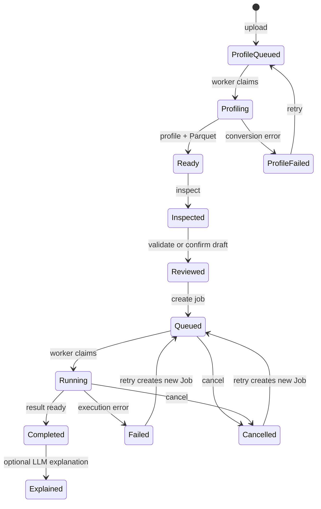

# LM Agent 前端檔案上傳與分析串接指南

> 適用分支：`codex/session-analysis-workspace`<br>
> API 版本：`0.12.0`<br>
> 更新日期：2026-07-30<br>
> 執行時最終契約：`GET /openapi.json`

本文件說明前端如何依使用目的選擇上傳 API，並完成 Session 附件問答、知識庫文件
上傳，以及 Excel／CSV 確定性分析。所有範例的 API 根網址均以
`http://127.0.0.1:8000/api/v1` 表示。

## 1. 先決定檔案要走哪條流程

| 使用目的 | 建議格式 | 上傳 API | 後端處理 | 前端取得結果 |
| --- | --- | --- | --- | --- |
| 單次對話閱讀、摘要、比對文件 | PDF、DOCX、PPTX、圖片、文字、程式碼 | `POST /documents/upload`，`scope=session` | 轉 Markdown、切片、Embedding、Session 內檢索 | Chat JSON 或 SSE |
| 長期保存並供多人依權限查詢 | 同上 | `POST /documents/upload`，`scope=knowledge_base` | 轉 Markdown、切片、Embedding、知識庫索引 | Chat JSON 或 SSE |
| Excel／CSV 欄位提取、篩選、分組與統計 | XLSX、CSV | `POST /analysis/files/upload` | 不進知識庫；由後端依白名單計畫確定性運算 | Table／Chart JSON |

不要用 `/documents/upload` 處理大型 Excel 的精確統計。該路徑的目的是將內容轉為
可檢索文字，適合問答，不保證能保留完整表格型別、全部列數與精確計算結果。

反過來，`/analysis/files/upload` 只接受 `.xlsx` 與 `.csv`，不會建立文件 chunk、
Embedding 或知識庫內容，也不能直接用附件問答 API 檢索。

## 2. 前端共用設定

除 Health 與 LLMWiki demo 外，請求都必須帶入 Bearer token。上傳使用
`FormData` 時，不要自行設定 `Content-Type`；瀏覽器需要自動補上 multipart boundary。

```ts
const API_BASE = "http://127.0.0.1:8000/api/v1";

type ApiErrorBody = {
  request_id?: string;
  error_code?: string;
  message?: string;
  details?: Record<string, unknown>;
};

async function apiFetch(
  path: string,
  token: string,
  init: RequestInit = {},
): Promise<Response> {
  const headers = new Headers(init.headers);
  headers.set("Authorization", `Bearer ${token}`);
  headers.set("X-Request-ID", crypto.randomUUID());

  const response = await fetch(`${API_BASE}${path}`, {
    ...init,
    headers,
  });

  if (!response.ok) {
    const body = (await response.json().catch(() => ({}))) as ApiErrorBody;
    const error = new Error(body.message ?? `HTTP ${response.status}`);
    Object.assign(error, {
      status: response.status,
      errorCode: body.error_code,
      details: body.details,
    });
    throw error;
  }
  return response;
}

async function apiJson<T>(
  path: string,
  token: string,
  init: RequestInit = {},
): Promise<T> {
  const response = await apiFetch(path, token, init);
  return (await response.json()) as T;
}
```

正式前端的來源必須包含於後端 `CORS_ALLOW_ORIGINS`。預設僅允許：

```text
http://127.0.0.1:5173
http://localhost:5173
```

## 3. 文件附件上傳與問答

### 3.1 取得後端支援格式

前端不要硬編碼完整副檔名清單。畫面載入時呼叫：

```http
GET /api/v1/documents/formats
```

```ts
type DocumentFormatsResponse = {
  items: Array<{
    extension: string;
    file_type: string;
    category: string;
  }>;
  accept: string;
};

const formats = await apiJson<DocumentFormatsResponse>(
  "/documents/formats",
  token,
);
fileInput.accept = formats.accept;
```

目前類別包含 PDF、圖片、Office、文字、結構化文字與常見程式碼格式。若後端新增格式，
前端重新讀取 `accept` 即可同步。

### 3.2 上傳第一個 Session 附件

第一個附件可以不傳 `session_id`，後端會建立 Session，前端必須保存回傳的
`session_id`。若一次選擇多檔，請先完成第一個上傳，再以其 `session_id` 上傳剩餘
檔案；否則平行上傳且都不帶 Session ID 時，每個檔案會建立不同 Session。

```ts
type DocumentUploadResponse = {
  request_id: string;
  document_id: string;
  status: "uploaded";
  scope: "session" | "knowledge_base";
  knowledge_base_id: string | null;
  session_id: string | null;
  message: string;
};

async function uploadSessionDocument(
  file: File,
  token: string,
  sessionId?: string,
  chatType: "general" | "code" = "general",
): Promise<DocumentUploadResponse> {
  const form = new FormData();
  form.append("file", file);
  form.append("scope", "session");
  form.append("chat_type", chatType);
  form.append("confidential_level", "internal");
  if (sessionId) form.append("session_id", sessionId);

  return apiJson<DocumentUploadResponse>(
    "/documents/upload",
    token,
    { method: "POST", body: form },
  );
}
```

上傳成功只表示檔案已保存並排入文件 Worker，不表示已可問答。畫面可立即建立一筆
附件卡片，狀態顯示為 `uploaded`。

### 3.3 輪詢文件處理狀態

```ts
type DocumentStatusResponse = {
  document_id: string;
  status:
    | "uploaded"
    | "parsing"
    | "ocr_processing"
    | "chunking"
    | "embedding"
    | "indexing"
    | "ready"
    | "failed"
    | "archived";
  progress: number;
  message: string;
};

const delay = (ms: number) =>
  new Promise<void>((resolve) => setTimeout(resolve, ms));

async function waitUntilDocumentReady(
  documentId: string,
  token: string,
  signal?: AbortSignal,
): Promise<DocumentStatusResponse> {
  for (;;) {
    if (signal?.aborted) throw new DOMException("Aborted", "AbortError");

    const state = await apiJson<DocumentStatusResponse>(
      `/documents/${documentId}/status`,
      token,
      { signal },
    );

    if (state.status === "ready") return state;
    if (state.status === "failed" || state.status === "archived") {
      throw new Error(state.message);
    }
    await delay(1500);
  }
}
```

建議前端：

- 只在 `ready` 後允許勾選該附件送出問答。
- `failed` 時顯示 `message`，並提供重新上傳或 `POST /documents/{id}/reindex` 的管理員操作。
- 元件卸載、換頁或使用者取消時中止輪詢。
- PDF 可能經 OCR，處理時間會明顯長於純文字檔。

正式服務必須另外啟動：

```bash
python -m app.workers.document_tasks
```

### 3.4 顯示與刪除 Session 附件

```http
GET    /api/v1/chat/sessions/{session_id}/attachments
DELETE /api/v1/chat/sessions/{session_id}/attachments/{document_id}
```

列表項目包含 `document_id`、`filename`、`file_type`、`status`、`page_count`、
`chunk_count` 與 `created_at`。刪除單一附件後，前端需同步移除已勾選的
`attachment_ids`。

### 3.5 指定附件進行問答

只查使用者勾選的附件：

```ts
type RetrievalScope =
  | "auto"
  | "attachments_only"
  | "session_attachments"
  | "knowledge_bases_only"
  | "session_and_knowledge_bases";

type ChatQueryResponse = {
  request_id: string;
  session_id: string;
  message_id: string;
  answer: string;
  sections: {
    key_points: string[];
    sources: string[];
    confidence: string | null;
    limitations: string[];
  };
  usage: {
    prompt_tokens: number | null;
    completion_tokens: number | null;
    total_tokens: number | null;
  };
  citations: Array<Record<string, unknown>>;
  images: Array<Record<string, unknown>>;
  confidence: string;
  risk_level: string;
  masked_entities: Array<Record<string, unknown>>;
  tool_calls: Array<Record<string, unknown>>;
};

const response = await apiJson<ChatQueryResponse>(
  "/chat/query",
  token,
  {
    method: "POST",
    headers: { "Content-Type": "application/json" },
    body: JSON.stringify({
      session_id: sessionId,
      query: "比較兩份報告的差異",
      knowledge_base_ids: [],
      attachment_ids: selectedDocumentIds,
      retrieval_scope: "attachments_only" satisfies RetrievalScope,
      top_k: 8,
      use_rerank: true,
      use_masking: true,
      use_tools: false,
    }),
  },
);
```

`retrieval_scope` 的前端選項：

| 值 | 使用時機 | 必要欄位 |
| --- | --- | --- |
| `auto` | 相容舊流程；有 `attachment_ids` 時只查指定附件 | 視輸入而定 |
| `attachments_only` | 只查勾選附件 | `session_id`、非空 `attachment_ids` |
| `session_attachments` | 查目前 Session 全部 `ready` 附件 | `session_id` |
| `knowledge_bases_only` | 不查暫存附件，只查指定知識庫 | 非空 `knowledge_base_ids` |
| `session_and_knowledge_bases` | 合併 Session 附件與授權知識庫 | `session_id`，通常也傳知識庫 ID |

`attachment_ids` 與 `knowledge_base_ids` 各最多 20 筆。附件必須屬於相同 Session、
狀態為 `ready`，且呼叫者必須是 Session 擁有者或管理員。

一般 Chat 使用 `chat_type=general` 的 Session；程式碼助理使用 `chat_type=code` 的
Session，兩者不可混用。Code Chat 的請求路徑為 `/code-chat/query` 或
`/code-chat/stream`，附件欄位與檢索範圍相同。

### 3.6 POST SSE 串流

瀏覽器原生 `EventSource` 不能直接送出帶 JSON body 與 Authorization header 的 POST。
請使用 `fetch()` 讀取 response stream，或採用支援 POST SSE 的 client library。

```ts
type SseEvent = {
  event: "start" | "delta" | "done" | "error";
  text?: string;
  response?: ChatQueryResponse;
  error_code?: string;
  message?: string;
};

async function streamChat(
  payload: Record<string, unknown>,
  token: string,
  onEvent: (event: SseEvent) => void,
  signal?: AbortSignal,
): Promise<void> {
  const response = await apiFetch("/chat/stream", token, {
    method: "POST",
    headers: {
      "Content-Type": "application/json",
      Accept: "text/event-stream",
    },
    body: JSON.stringify(payload),
    signal,
  });

  if (!response.body) throw new Error("Streaming response body is unavailable.");

  const reader = response.body.pipeThrough(new TextDecoderStream()).getReader();
  let buffer = "";

  for (;;) {
    const { value, done } = await reader.read();
    if (done) break;
    buffer += value;

    let boundary = buffer.indexOf("\n\n");
    while (boundary >= 0) {
      const block = buffer.slice(0, boundary);
      buffer = buffer.slice(boundary + 2);

      const eventName =
        block.match(/^event:\s*(.+)$/m)?.[1]?.trim() ?? "message";
      const data = block
        .split("\n")
        .filter((line) => line.startsWith("data:"))
        .map((line) => line.slice(5).trimStart())
        .join("\n");

      if (data) {
        onEvent({ event: eventName, ...JSON.parse(data) } as SseEvent);
      }
      boundary = buffer.indexOf("\n\n");
    }
  }
}
```

事件處理原則：

- `start`：保存 `session_id`、`message_id`。
- `delta`：把 `text` 追加到暫存回答。
- `done`：以 `response` 覆蓋暫存回答，並渲染 `sections`、`citations`、`usage`。
- `error`：顯示 `error_code` 與 `message`，停止 loading。

不要只保存 `delta` 組合文字；`done.response` 才是後端完成解析、DLP 與結構化後的
最終結果。

## 4. 知識庫文件上傳

知識庫文件使用相同的 `/documents/upload`，但 scope 欄位不同：

```ts
async function uploadKnowledgeBaseDocument(
  file: File,
  knowledgeBaseId: string,
  token: string,
): Promise<DocumentUploadResponse> {
  const form = new FormData();
  form.append("file", file);
  form.append("scope", "knowledge_base");
  form.append("knowledge_base_id", knowledgeBaseId);
  form.append("confidential_level", "internal");
  form.append("department", "RD");

  return apiJson<DocumentUploadResponse>(
    "/documents/upload",
    token,
    { method: "POST", body: form },
  );
}
```

規則：

- `scope=knowledge_base` 必須傳 `knowledge_base_id`，不得傳 `session_id`。
- 呼叫者必須具有知識庫寫入權限。
- 同樣必須輪詢至 `ready` 後才能穩定檢索。
- 知識庫文件是長期資料；刪除 Chat Session 不會刪除它。

## 5. Excel／CSV 分析工作區

### 5.1 前端狀態流程



分析檔上傳有兩種歸屬方式：

- Session 模式：傳入 `session_id`；若 Session 尚未連結 Workspace，後端會建立或
  沿用使用者的私人 Workspace。
- Workspace 模式：不傳 Session，但 `workspace_id` 必填。

若同時傳入兩者，Session 不得已連到其他 Workspace。前端可透過
`GET /workspaces` 顯示可用工作區，並以回覆的 `permission` 決定 UI：read 只能查看，
write 可上傳、執行與建立 artifact，admin 可管理 Workspace 與分享規則。

### 5.2 上傳分析檔

```ts
type AnalysisFileUploadResponse = {
  file_id: string;
  workspace_id: string;
  session_id: string | null;
  filename: string;
  file_type: "xlsx" | "csv";
  size_bytes: number;
  status: "profile_queued" | "profiling" | "ready" | "failed";
  profile_progress: number;
  profile_error: string | null;
  dataset_count: number;
  profiled_at: string | null;
  expires_at: string | null;
};

async function uploadAnalysisFile(
  file: File,
  token: string,
  target: { sessionId?: string; workspaceId?: string },
): Promise<AnalysisFileUploadResponse> {
  if (!target.sessionId && !target.workspaceId) {
    throw new Error("sessionId or workspaceId is required");
  }
  const form = new FormData();
  form.append("file", file);
  if (target.sessionId) form.append("session_id", target.sessionId);
  if (target.workspaceId) form.append("workspace_id", target.workspaceId);
  form.append("confidential_level", "internal");

  return apiJson<AnalysisFileUploadResponse>(
    "/analysis/files/upload",
    token,
    { method: "POST", body: form },
  );
}
```

預設限制：

| 項目 | 預設值 |
| --- | --- |
| 上傳檔案大小 | 500 MB |
| 可掃描資料列 | 5,000,000 |
| 最大群組數 | 5,000 |
| 回傳資料列 | 5,000 |
| 背景 Profile 樣本列 | 50（舊同步 inspect fallback 為 20） |
| Job timeout | 1,800 秒 |
| Workspace 檔案保存期限 | 預設持久保存 |

### 5.3 Inspect 工作表與欄位

```http
GET /api/v1/analysis/files/{file_id}/inspect
```

回覆的每個 sheet 包含 `name`、`row_count`、`column_count`、`columns` 與
`sample_rows`。前端應直接使用 `columns[].name` 組成欄位選單，不要自行修改或猜測欄名。
空白欄名會由後端正規化為 `column_1`，重複欄名會加上 `_2`、`_3`。

CSV 的 sheet 名固定為 `CSV`，`row_count` 可能為 `null`。支援 UTF-8、UTF-8 BOM、
Big5 與 CP950。

### 5.4 建立並驗證 AnalysisPlan

```ts
const plan = {
  sheet: "Production",
  select: [],
  group_by: ["Machine"],
  filters: [
    { column: "Yield", operator: "gte", value: 80 },
  ],
  aggregations: [
    { function: "count", alias: "sample_count" },
    { function: "mean", column: "Yield", alias: "mean_yield" },
    { function: "std", column: "Yield", alias: "std_yield" },
    {
      function: "count_if",
      alias: "below_95",
      condition: { column: "Yield", operator: "lt", value: 95 },
    },
  ],
  sort: [{ column: "mean_yield", direction: "asc" }],
  limit: 1000,
  charts: [
    {
      type: "bar",
      x_field: "Machine",
      y_field: "mean_yield",
      title: "Average yield by machine",
    },
  ],
};

const validation = await apiJson<{
  valid: true;
  normalized_plan: typeof plan;
  warnings: string[];
}>("/analysis/plans/validate", token, {
  method: "POST",
  headers: { "Content-Type": "application/json" },
  body: JSON.stringify({ file_id: fileId, plan }),
});
```

前端建立計畫時必須遵守：

- `select`、`aggregations`、`pivot`、`correlation` 至少一項。
- `group_by` 最多 5 欄，filters 與 aggregations 各最多 20 筆。
- filter operator：`eq`、`ne`、`gt`、`gte`、`lt`、`lte`、`contains`、`in`、
  `is_null`、`not_null`。
- aggregation：`count`、`distinct_count`、`sum`、`mean`、`std`、`min`、`max`、
  `count_if`、`percentile`；percentile 使用 `0..1`，中位數為 `0.5`。
- chart：`bar`、`line`、`scatter`，最多 5 張。
- `sources` 最多 8 個，`joins` 最多 7 個；所有檔案必須屬於同一 Workspace。
- date bucket 支援 `day`、`week`、`month`、`quarter`、`year`。
- Pivot 與 correlation 不能同時使用；correlation 支援 Pearson、Spearman。
- 無 aggregation 時目前不支援 raw rows 排序。
- 有 aggregation 時，`select` 會被忽略，輸出欄位來自 `group_by` 與 aggregation alias。
- 每個 aggregation alias 必須唯一，也不得與 `group_by` 欄名相同；前後端皆應檢查，
  後端會拒絕碰撞以避免覆蓋結果欄位。

### 5.5 建立 Job 並輪詢

```ts
type AnalysisJobResponse = {
  job_id: string;
  workspace_id: string;
  session_id: string | null;
  file_id: string;
  status: "queued" | "running" | "completed" | "failed" | "cancelled";
  plan: Record<string, unknown>;
  progress: number;
  result: AnalysisResult | null;
  error_message: string | null;
  retry_of_job_id: string | null;
  draft_id: string | null;
  cancel_requested_at: string | null;
  created_at: string;
  updated_at: string;
  finished_at: string | null;
};

const job = await apiJson<AnalysisJobResponse>(
  "/analysis/jobs",
  token,
  {
    method: "POST",
    headers: { "Content-Type": "application/json" },
    body: JSON.stringify({
      file_id: fileId,
      plan: validation.normalized_plan,
    }),
  },
);

async function waitUntilAnalysisFinished(
  jobId: string,
  token: string,
): Promise<AnalysisJobResponse> {
  for (;;) {
    const state = await apiJson<AnalysisJobResponse>(
      `/analysis/jobs/${jobId}`,
      token,
    );
    if (state.status === "completed") return state;
    if (state.status === "failed" || state.status === "cancelled") {
      throw new Error(state.error_message ?? "Analysis failed.");
    }
    await delay(1500);
  }
}
```

正式服務必須另外啟動：

```bash
python -m app.workers.analysis_tasks
```

若 Worker 未啟動，Job 會一直停在 `queued`。

### 5.6 渲染 Table 與 Chart JSON

```ts
type AnalysisResult = {
  summary: {
    processed_rows: number;
    matched_rows: number;
    result_rows: number;
    returned_rows: number;
    truncated: boolean;
    warnings: string[];
    query_engine?: string;
  };
  table: {
    columns: Array<{ key: string; label: string }>;
    rows: Array<Record<string, unknown>>;
  };
  charts: Array<{
    schema_version: "1.0" | "2.0";
    type: "bar" | "line" | "scatter";
    title: string;
    x_field: string;
    y_field: string;
    series_field?: string | null;
    x_type?: "category" | "value" | "time";
    y_unit?: string | null;
    decimal_places?: number;
    tooltip_fields?: string[];
    zoom?: boolean;
    data: Array<Record<string, unknown>>;
  }>;
  plan: Record<string, unknown>;
};
```

前端表格以 `table.columns` 決定欄序，以 `table.rows` 顯示內容。圖表元件直接讀取
`type`、`x_field`、`y_field` 與 `data`，不需要解析 LLM 文字。

若 `summary.truncated=true`，必須顯示「畫面僅呈現部分結果」；統計摘要仍代表完整
符合條件的資料，但表格與圖表只包含回傳上限內的列。

### 5.7 選擇性 LLM 解說

Job 完成後才可呼叫：

```http
POST /api/v1/analysis/jobs/{job_id}/explain
```

回覆：

```json
{
  "job_id": "JOB_UUID",
  "answer": "各機台的平均良率...",
  "usage": {
    "prompt_tokens": 820,
    "completion_tokens": 180,
    "total_tokens": 1000
  }
}
```

LLM 只解釋後端已算好的 bounded result JSON，不執行 Python／SQL，也不應重新計算
或改寫數值。前端應把原始表格與圖表視為主結果，把 LLM 解說視為輔助說明。

### 5.8 列表與清理

```http
GET    /api/v1/analysis/files?session_id={session_id}
GET    /api/v1/analysis/files?workspace_id={workspace_id}
DELETE /api/v1/analysis/files/{file_id}
```

刪除分析檔會一併刪除其 Job 與本機檔案。刪除 Session 只清除 Session
附件與聊天訊息，分析檔與 Job 會解除 Session 關聯並繼續保留在 Workspace。

### 5.9 分析 Job 列表、進度、取消與重試

```http
GET  /api/v1/analysis/jobs?session_id={session_id}&page=1&page_size=50
GET  /api/v1/analysis/jobs?workspace_id={workspace_id}&page=1&page_size=50
POST /api/v1/analysis/jobs/{job_id}/cancel
POST /api/v1/analysis/jobs/{job_id}/retry
```

列表可選擇加入 `file_id` 與 `status` 篩選。Job 回覆新增：

```json
{
  "progress": 10,
  "retry_of_job_id": null,
  "cancel_requested_at": null
}
```

`progress` 為階段式進度，不代表精確列數百分比：queued 為 0、claimed 為 5、
分析子行程執行中為 10、completed／failed 為 100。取消 running Job 後，
後端會立即回覆 `cancelled`，Worker 隨後終止該 Job 的分析子行程。重試只允許
failed／cancelled，並建立新的 Job ID，原 Job 保留供稽核。

### 5.10 Excel 警告與 ECharts

`GET /api/v1/analysis/files/{file_id}/inspect` 的 response 與各 Sheet 皆有
`warnings`。前端必須顯示公式快取、缺少公式快取值、Excel 顯示格式不保留等警告。

分析結果的 `charts[]` 由 `frontend/echarts-adapter.js` 轉換：

```js
const instance = LMAnalysisCharts.render(
  document.querySelector("#chart.analysis-chart"),
  job.result.charts[0],
);
```

前端已隨附 ECharts 6.1.0 runtime，不需外部 CDN。圖表容器應套用
`analysis-chart` class 以確保有可渲染高度。Adapter 僅接受 bar、line、
scatter，不執行 API 或 LLM 回傳的 JavaScript。

### 5.11 背景 Profiling 與 Parquet

新上傳的 Excel／CSV 先回覆 `status: "profile_queued"`。前端以
`GET /api/v1/analysis/files/{file_id}` 輪詢：

```json
{
  "status": "profiling",
  "profile_progress": 10,
  "profile_error": null,
  "dataset_count": 0
}
```

只有 `status=ready` 才開放計畫建立。完成後 `dataset_count` 代表 CSV 資料集或
XLSX Sheet 數量。`failed` 時顯示 `profile_error`，並讓使用者呼叫
`POST /api/v1/analysis/files/{file_id}/profile/retry`。

不要在收到 upload response 後立刻呼叫 inspect；尚未完成時會回傳 HTTP 409
`DOCUMENT_NOT_READY`，`details` 會包含 `status`、`progress` 與 `error`。

大型資料前端不接收原始 Parquet 路徑。所有 Join 與欄位選擇只傳 `file_id`、
Sheet 名與 alias，後端從受控 `dataset_manifest` 解析實體路徑。

### 5.12 自然語言草稿與確認

```http
POST /api/v1/analysis/plan-drafts
Content-Type: application/json

{
  "workspace_id": "WORKSPACE_UUID",
  "session_id": "SESSION_UUID",
  "question": "依月份與產線比較良率中位數",
  "file_ids": ["FILE_UUID"]
}
```

回覆包含受限 `plan`、`warnings`、`usage` 與
`confirmation_required: true`。前端應顯示來源、Join、欄位、Filter、統計與圖表，
允許使用者檢查後再呼叫：

```http
POST /api/v1/analysis/plan-drafts/{draft_id}/confirm

{"plan": null}
```

confirm 前不會建立 Job。若前端傳入編輯後的 `plan`，後端會重新以實際 Parquet
schema 驗證。confirm 成功回傳 HTTP 202 `AnalysisJobResponse`，代表 Job 已建立；
此路徑不需要再呼叫 `POST /analysis/jobs`。

多 Sheet／多檔計畫範例：

```json
{
  "sources": [
    {"file_id": "PRODUCTION_FILE_UUID", "alias": "p", "sheet": "Production"},
    {"file_id": "MACHINE_FILE_UUID", "alias": "m", "sheet": "Machines"}
  ],
  "joins": [
    {
      "left_alias": "p",
      "right_alias": "m",
      "left_on": ["Machine"],
      "right_on": ["Machine"],
      "how": "left"
    }
  ],
  "date_buckets": [
    {"column": "p.Date", "unit": "month", "alias": "month"}
  ],
  "group_by": ["month", "m.Line"],
  "aggregations": [
    {
      "function": "percentile",
      "column": "p.Yield",
      "percentile": 0.5,
      "alias": "median_yield"
    }
  ],
  "charts": [
    {
      "type": "line",
      "x_field": "month",
      "y_field": "median_yield",
      "series_field": "m.Line",
      "x_type": "time",
      "y_unit": "%",
      "zoom": true
    }
  ]
}
```

### 5.13 Hybrid 與成果管理

`POST /api/v1/analysis/hybrid-answer` 同時接收 `analysis_job_ids` 與
`knowledge_base_ids`。回覆保留 KB citations 與 `report_artifact_id`。分析結果是
不可修改的數據事實，KB 片段只用於 SOP、定義與背景解釋。

`create_report=true` 會在 Workspace 建立 Markdown artifact，因此要求 write 權限；
若只需要回答且使用者只有 read，請送出 `create_report=false`。

完成 Job 可建立下列 artifact：

```http
POST /api/v1/analysis/jobs/{job_id}/export
POST /api/v1/analysis/jobs/{job_id}/reports
POST /api/v1/analysis/jobs/{job_id}/charts
GET  /api/v1/workspaces/{workspace_id}/artifacts/{artifact_id}/download
```

Export 支援 `csv`、`json`、`parquet`。Chart artifact 保存平台
Chart Schema，不保存或執行任意 ECharts JavaScript。

## 6. UI 狀態與錯誤處理建議

| HTTP／錯誤碼 | 前端行為 |
| --- | --- |
| `401 UNAUTHORIZED` | 清除失效登入狀態並重新驗證 |
| `403 PERMISSION_DENIED` | 顯示無權限，不重試 |
| `404 DOCUMENT_NOT_FOUND`／`ANALYSIS_NOT_FOUND` | 從目前清單移除已不存在的資源 |
| `409` explain 尚未完成 | 保持 Job 輪詢，不呼叫解說 |
| `413` | 顯示檔案、列數或群組超過限制 |
| `422` | 顯示欄位驗證錯誤；通常是缺少條件式必填欄位或 UUID 格式錯誤 |
| `ATTACHMENT_NOT_READY` | 回到附件狀態輪詢 |
| `CHAT_BUSY` | 短暫等待後由使用者重試 |
| `CHAT_TIMEOUT` | 保留使用者輸入並提供重新送出 |
| `PROMPT_TOO_LARGE` | 減少附件、`top_k`、程式碼或歷史內容 |

同一個檔案／Job 的重複送出按鈕在請求完成前應停用。上傳可顯示瀏覽器端進度，
但 `fetch()` 本身沒有可靠的 upload progress event；若需要精確上傳百分比，可改用
`XMLHttpRequest`，後端 API 契約不需改變。

## 7. 最小部署檢查

前端串接前確認：

1. `GET /api/v1/health` 回傳成功。
2. `GET /api/v1/health/dependencies` 的 PostgreSQL、Embedding 與 LLM 狀態符合功能需求。
3. 已執行 `python -m app.db.init_db` 建立 `analysis_files`、`analysis_jobs` 等資料表。
4. 已啟動 `python -m app.workers.document_tasks`。
5. 需要 Excel／CSV 分析時，已啟動 `python -m app.workers.analysis_tasks`。
6. 前端 origin 已加入 `CORS_ALLOW_ORIGINS`。
7. 部署環境可由 `/docs`、`/redoc` 或 `/openapi.json` 核對實際 API 版本。
