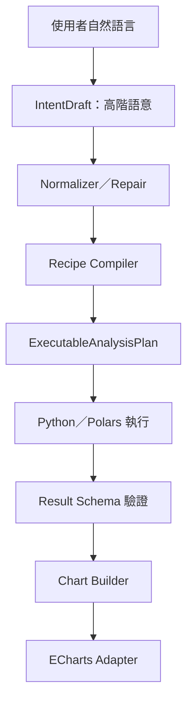

# LM Agent 分析工作區穩定性與泛用性升級計劃書

> 目標分支：`codex/session-analysis-workspace`  
> 文件版本：1.0  
> 制定日期：2026-07-30  
> 適用範圍：Workspace、XLSX／CSV 分析、AnalysisPlan、Python／Polars 執行器、ECharts 圖表、分析 Job 與 LLM 規劃流程  
> 主要讀者：後續執行實作的 LLM、後端工程師、前端工程師、測試與維運人員

> 實作狀態（2026-07-31）：Phase 0–6 已於功能分支完成。Phase 5 加入版本化
> 統計／品質 Recipe 與品質圖表；Phase 6 加入 Workspace-scoped Recipe 指標、
> 結構化 Job 錯誤與耗時、rollout feature flags、additive migration、安全／
> load／cancel 回歸，以及正式部署與回復 checklist。

## 1. 文件目的

本文件將 LM Agent 目前已討論的分析工作區升級方向整理成可逐步執行、驗證及回復的完整實作計劃。

此次升級的核心不是讓 LLM 任意編寫並執行 Python，而是建立以下穩定邊界：

1. LLM 只辨識使用者的分析意圖、資料欄位與少量參數。
2. 後端正規化並修復 LLM 草稿。
3. Recipe Compiler 將高階意圖編譯成受白名單限制、可驗證的執行計畫。
4. Python／Polars 執行器負責確定性計算。
5. 圖表建構器依「實際結果 schema」產生 Chart Schema。
6. 前端僅將受信任的 Chart Schema 轉為 ECharts option，不執行模型產生的 JavaScript。

本計劃特別針對企業內部 31B、無思考模式模型設計。不得假設模型能穩定輸出複雜巢狀 JSON、正確猜測衍生欄位名稱，或自行修正資料型別與圖表契約。

---

## 2. 升級摘要

### 2.1 主要問題

目前自然語言分析會要求 LLM 直接輸出完整 `AnalysisPlan`。當使用者要求「將數值每 10 當作間距統計數量後繪製直方圖」時，模型可能輸出：

```json
{
  "type": "line",
  "x": null,
  "y": ["data.text"]
}
```

但目前 `ChartSpec` 要求：

```json
{
  "type": "bar",
  "x_field": "bin_label",
  "y_field": "record_count"
}
```

錯誤發生的原因不只是不相容的欄位名稱，也包含：

- 模型使用舊契約 `x`／`y`，後端只接受 `x_field`／`y_field`。
- 模型在資料分析完成前，不知道分桶後真正存在的輸出欄位。
- 目前 `AnalysisPlan` 沒有專用的 histogram operation。
- 圖表欄位在 Pydantic 建模階段即為必填，尚未進入後端推導或修復流程就被拒絕。
- 直方圖是「先分桶與計數，再畫 bar」，不應由模型自行拼湊 `group_by` 與圖表。

### 2.2 目標解法

建立三層資料契約：



LLM 對直方圖只需輸出：

```json
{
  "recipe_id": "histogram",
  "version": "1.0",
  "inputs": {
    "source_field": "thickness",
    "bin_width": 10
  },
  "chart_enabled": true
}
```

後端固定產生：

```json
{
  "result_columns": [
    "bin_start",
    "bin_end",
    "bin_label",
    "record_count"
  ],
  "chart": {
    "type": "bar",
    "semantic_type": "histogram",
    "x_field": "bin_label",
    "y_field": "record_count"
  }
}
```

---

## 3. 現有分支基線

本計劃以 `codex/session-analysis-workspace` 為唯一實作基線。後續 LLM 必須先確認實際程式碼，不能將本文件中的「待升級」誤認為已完成，也不能重作下列既有能力。

### 3.1 已完成且必須保留

| 項目 | 現況 |
|---|---|
| Workspace | 已具備持久化 Workspace、Session 關聯、權限與 Artifact |
| 分析檔案 | `.xlsx`／`.csv` 走 `/api/v1/analysis/files/upload`，不進入 RAG |
| Office 相容層 | XLSX 先由 Excel COM／pywin32 唯讀開啟並建立短期 OpenXML 副本 |
| 原檔保留 | 原始 XLSX／CSV 保留，不應只保存 Markdown |
| 預處理 | Sheet／CSV 轉 Parquet，產生 profile 與 dataset manifest |
| 執行引擎 | 既定 Python 與 Polars Lazy Query，不執行 LLM 產生的 Python／SQL／JavaScript |
| AnalysisPlan | 已支援 select、filter、group、aggregation、join、date bucket、pivot、correlation |
| 圖表 | Chart Schema v2 已支援 bar、line、scatter 與 ECharts Adapter |
| Job | 已具備 list、progress、cancel、retry、result 與 artifact |
| 聚合 alias | 已檢查重複 alias 及 alias 與 `group_by` 衝突 |
| Result 截斷 | `summary.result_rows` 與 `summary.truncated` 已能反映完整結果筆數 |
| Excel 警告 | 已有公式快取值、格式未保留及 sample 範圍警告 |
| 使用者確認 | 自然語言 draft 必須確認後才建立 Job |
| 安全 | 檔案、Workspace、Sheet、欄位、路徑與執行上限皆受後端控制 |

### 3.2 現有關鍵程式

| 路徑 | 目前責任 |
|---|---|
| `app/schemas/analysis.py` | AnalysisPlan、ChartSpec、Job 與回應 schema |
| `app/services/analysis_orchestrator_service.py` | 自然語言轉完整 AnalysisPlan draft |
| `app/services/dataset_query_service.py` | Plan 驗證與 Polars 執行 |
| `app/services/spreadsheet_analysis_service.py` | 單檔試算表分析相容流程 |
| `app/services/analysis_job_service.py` | 分析 Job 生命週期 |
| `app/workers/analysis_tasks.py` | Profile 與分析背景執行 |
| `frontend/echarts-adapter.js` | Chart Schema 轉 ECharts option |
| `docs/session_analysis_workspace.md` | 現有 Workspace 與前後端使用說明 |

### 3.3 目前缺口

- `ChartSpec` 在草稿入口直接要求 `x_field`／`y_field`，缺乏舊欄位正規化。
- 無高階 `IntentDraft` 與可執行 `AnalysisPlan` 的分層。
- 無版本化 Recipe Registry 與 Recipe Compiler。
- 無專用 histogram、Pareto、boxplot、control chart、capability 等操作。
- 圖表仍可能由 LLM 直接指定最終欄位。
- 欄位 profile 缺少唯一 ID、單位、完整數值摘要、基數、缺失率等語意資訊。
- 模型草稿第一次失敗後只回 422，缺乏受限的一次修復流程。
- 圖表輸出尚未涵蓋常見品質分析與製程圖表。

---

## 4. 升級目標與非目標

### 4.1 目標

1. 消除可正規化的 `x`／`y` 與 `x_field`／`y_field` 相容錯誤。
2. 讓直方圖與常用統計不依賴 LLM 猜測衍生欄位。
3. 新增版本化、可測試、可稽核的 Recipe Registry。
4. 擴充常用資料清理、統計、品質與圖表能力。
5. 保持現有 API 的向下相容性。
6. 讓所有計算可重現、可取消、可限制資源並可追蹤來源。
7. 提供固定錯誤碼與使用者可理解的修正提示。
8. 讓後續新增 Recipe 時，不必持續擴大 LLM prompt 或修改前端任意程式碼。

### 4.2 非目標

- 不允許 LLM 在正式流程中任意生成並執行 Python。
- 不允許使用者或模型提供伺服器檔案路徑。
- 不允許模型輸出或執行 ECharts JavaScript option。
- 不以 Markdown 取代 XLSX／CSV 原檔與 Parquet dataset。
- 不將大量結構化資料送入 RAG。
- 不在 Uvicorn API 行程中執行大型分析。
- 不讓 LLM 修改後端已計算完成的數值。

---

## 5. 設計原則

### 5.1 LLM 規劃、後端決策

LLM 可以選擇分析意圖、欄位與參數，但以下內容必須由後端決定：

- 衍生欄位的實際名稱。
- 結果 schema。
- 圖表 `x_field`、`y_field` 與 `series_field`。
- Python／Polars 表達式。
- 空值、負數、日期、邊界值與型別轉換規則。
- 資源限制、路徑、權限與輸出格式。

### 5.2 先運算、後建圖

圖表欄位必須對照「執行後結果 schema」，不能只對照原始 Excel schema。

### 5.3 確定性與可重現

相同資料 hash、Recipe 版本與參數必須產生相同結果。Job 必須保留：

- 使用者原始需求。
- LLM 原始草稿。
- 正規化後意圖。
- 編譯後執行計畫。
- Recipe ID／版本。
- 資料檔與 dataset hash。
- 執行引擎版本。
- 警告、列數、耗時與結果 hash。

### 5.4 相容而不猜測

可無歧義正規化時自動轉換；會影響分析意義時不得自行猜測。

例如：

- `x: "Machine"` 可轉為 `x_field: "Machine"`。
- `y: ["count"]` 且陣列只有一個值時，可轉為 `y_field: "count"`。
- `x: null` 不可任意猜原始欄位，應交由 Recipe result contract 產生，或回傳明確錯誤。

---

## 6. 目標資料契約

### 6.1 IntentDraft

新增高階意圖 schema。此 schema 是 LLM 的主要輸出，不直接交給執行器。

```json
{
  "schema_version": "1.0",
  "sources": [
    {
      "file_id": "UUID",
      "sheet": "Production",
      "alias": "data"
    }
  ],
  "recipe_id": "histogram",
  "recipe_version": "1.0",
  "inputs": {
    "source_field": "Thickness",
    "bin_width": 10
  },
  "filters": [],
  "chart_enabled": true,
  "title": "厚度分布"
}
```

必要要求：

- `recipe_id` 必須存在於 Registry。
- `inputs` 只能包含該 Recipe 宣告的參數。
- 檔案、Sheet 與欄位都必須屬於使用者已核准的來源。
- 不接受 Python、SQL、JavaScript、函式內容與檔案路徑。

### 6.2 NormalizedIntent

Normalizer 完成以下工作：

- 欄位別名映射。
- `x`／`y` 舊格式相容。
- Recipe 同義詞映射，例如 `hist`、`直方圖` → `histogram`。
- 字串數字轉換，例如 `"10"` → `10`，但僅限 schema 明確要求數字時。
- 預設參數補齊。
- Sheet 與欄位唯一解析。
- 警告與修復紀錄。

每次正規化必須產生 `normalization_actions`，例如：

```json
[
  {
    "code": "LEGACY_CHART_X_MAPPED",
    "from": "x",
    "to": "x_field"
  }
]
```

### 6.3 RecipeDefinition

每個 Recipe 至少包含：

```json
{
  "recipe_id": "histogram",
  "version": "1.0",
  "category": "distribution",
  "allowed_input_types": ["integer", "float", "decimal"],
  "parameters": {
    "source_field": {"type": "column", "required": true},
    "bin_width": {"type": "number", "required": false, "gt": 0},
    "bin_count": {"type": "integer", "required": false, "min": 1, "max": 200},
    "include_null_count": {"type": "boolean", "default": true}
  },
  "result_schema": [
    "bin_start",
    "bin_end",
    "bin_label",
    "record_count"
  ],
  "chart_builder": "histogram_bar_v1"
}
```

Registry 必須能：

- 依 ID 及版本取得定義。
- 列出啟用的 Recipe。
- 驗證參數、欄位型別與必要欄位。
- 提供 LLM 精簡的可用 Recipe metadata。
- 禁用 Recipe 而不刪除歷史版本。

### 6.4 ExecutableAnalysisPlan

Compiler 將 `NormalizedIntent` 編譯為後端內部計畫。此計畫可以沿用並擴充目前 `AnalysisPlan`，但需標記：

- `plan_origin`: `direct`、`llm_intent`、`recipe`。
- `recipe_id`、`recipe_version`。
- `result_contract`。
- `derived_fields`。
- `compiler_version`。

LLM 不直接輸出 `derived_fields` 與內部執行運算。

### 6.5 ResultEnvelope

統一結果格式：

```json
{
  "schema_version": "3.0",
  "summary": {
    "processed_rows": 10000,
    "matched_rows": 9980,
    "result_rows": 24,
    "returned_rows": 24,
    "truncated": false,
    "warnings": [],
    "query_engine": "polars",
    "recipe_id": "histogram",
    "recipe_version": "1.0"
  },
  "schema": {
    "columns": [
      {"key": "bin_label", "type": "string", "semantic_type": "bin_label"},
      {"key": "record_count", "type": "integer", "semantic_type": "count"}
    ]
  },
  "table": {
    "columns": [],
    "rows": []
  },
  "charts": [],
  "lineage": {
    "dataset_hashes": [],
    "compiler_version": "1.0",
    "result_hash": "..."
  }
}
```

### 6.6 Chart Schema v3

保留 v1／v2 相容欄位，新增語意與多序列擴充：

```json
{
  "schema_version": "3.0",
  "chart_type": "bar",
  "semantic_type": "histogram",
  "title": "厚度分布（每 10 為一組）",
  "x_field": "bin_label",
  "y_field": "record_count",
  "series_field": null,
  "data": [],
  "axis": {
    "x_type": "category",
    "x_label": "厚度區間",
    "y_label": "數量"
  },
  "interaction": {
    "tooltip": true,
    "zoom": true,
    "export": true
  }
}
```

Chart Builder 必須從 Recipe result contract 與實際結果欄位建立此物件。LLM 只能提供標題等非關鍵顯示資訊。

---

## 7. Plan 正規化與修復流程

### 7.1 處理順序

1. 解析最外層 JSON。
2. 移除 Markdown code fence。
3. 若存在 `{ "plan": {...} }`，取出 `plan`。
4. 套用版本判斷與舊欄位映射。
5. 驗證使用者已核准的 file IDs。
6. 解析 Sheet 與欄位。
7. 驗證 Recipe 及其參數。
8. 編譯為執行計畫。
9. 對實際 dataset schema 驗證。
10. 儲存原始草稿、正規化結果與警告。

### 7.2 舊圖表相容規則

| 輸入 | 處理 |
|---|---|
| `x` 為非空字串 | 轉為 `x_field` |
| `y` 為非空字串 | 轉為 `y_field` |
| `y` 為單一元素陣列 | 取唯一元素作為 `y_field` |
| 同時有 `x` 與 `x_field` 且不同 | 拒絕，回傳 `AMBIGUOUS_CHART_FIELD` |
| `x` 或 `y` 為 null | Recipe 可決定時忽略舊圖表並重建；否則拒絕 |
| `type=line` 但語意為 histogram | Recipe Compiler 改為 `bar` 並記錄 warning |
| 欄位不在結果 schema | 不可直接執行，交由 Chart Builder 重建或回錯 |

### 7.3 一次性 LLM Repair

只有當 JSON 可解析但 Intent／Plan 驗證失敗時，允許最多一次 LLM repair：

- Repair prompt 只提供錯誤碼、允許欄位、Recipe 契約與原草稿。
- 不提供原始完整資料。
- 模型仍只能輸出 JSON。
- 修復後必須重新走完整權限與 schema 驗證。
- 第二次失敗即停止，不可無限重試。
- Job 尚未建立，因此不會執行任何計算。

可由後端確定性修正的項目不得浪費 LLM repair。

### 7.4 新增建議錯誤碼

| 錯誤碼 | 說明 |
|---|---|
| `ANALYSIS_INTENT_INVALID` | 高階意圖不符合 schema |
| `RECIPE_NOT_FOUND` | Recipe 不存在或未啟用 |
| `RECIPE_VERSION_UNSUPPORTED` | 指定版本不可用 |
| `RECIPE_PARAMETER_INVALID` | Recipe 參數錯誤 |
| `COLUMN_NOT_FOUND` | 欄位不存在 |
| `COLUMN_AMBIGUOUS` | 多個來源具有相同欄位，需 alias |
| `COLUMN_TYPE_INCOMPATIBLE` | 欄位型別不適用 |
| `AMBIGUOUS_CHART_FIELD` | 新舊圖表欄位互相衝突 |
| `RESULT_SCHEMA_MISMATCH` | 執行結果不符合 Recipe contract |
| `CHART_BUILD_FAILED` | 無法由已驗證結果建立圖表 |
| `ANALYSIS_REPAIR_FAILED` | 一次修復後仍無效 |

---

## 8. Recipe Registry 規劃

### 8.1 P0 必做 Recipe

#### `histogram`

用途：依固定間距或桶數統計連續數值分布。

參數：

- `source_field`
- `bin_width` 或 `bin_count`，兩者擇一
- `start`／`end`（選填）
- `include_null_count`
- `include_underflow`／`include_overflow`
- `closed`: 預設 `left`

固定規則：

- 預設區間為 `[start, end)`。
- 負數使用 `floor(value / bin_width) * bin_width` 對齊。
- 最大值若剛好等於最後邊界，必須被最後一桶包含。
- `bin_width <= 0` 拒絕。
- 超過 200 桶時拒絕或要求較大間距。
- 非數值與空值數量放在 summary，不混入數值桶。
- 後端固定輸出 `bin_start`、`bin_end`、`bin_label`、`record_count`。
- 後端固定建立 `semantic_type=histogram` 的 bar chart。

#### `category_summary`

用途：依類別統計 count、sum、mean、median、min、max。

固定輸出：`category`、一個或多個後端命名的 metric 欄位。

#### `trend_summary`

用途：依日、週、月、季、年或批次順序呈現統計趨勢。

固定輸出：`period`、`value`，可選 `series`。

#### `pareto`

用途：NG 原因、缺陷類別、機台異常次數排序與累積比例。

固定輸出：`category`、`count`、`ratio`、`cumulative_ratio`。

### 8.2 P1 常用資料處理 Recipe

| Recipe | 用途 | 主要輸入 |
|---|---|---|
| `data_quality_summary` | 空值、唯一值、重複、型別與異常格式摘要 | 欄位清單 |
| `missing_value_summary` | 各欄空值數與缺失率 | 欄位清單 |
| `duplicate_summary` | 依 key 找重複資料 | key 欄位 |
| `filter_rows` | 受限條件篩選 | 條件 |
| `derive_arithmetic` | 欄位加減乘除、比率、差異 | 模板、來源欄位 |
| `type_cast` | 安全型別轉換與失敗筆數 | 欄位、目標型別 |
| `date_parts` | 年、季、月、週、日、班別衍生 | 日期欄 |
| `group_summary` | 分組 count／sum／mean／median／std／quantile | 維度、指標 |
| `top_n` | 依指定指標取前／後 N 名 | 維度、指標、N |
| `pivot_table` | 交叉表 | index、column、value、aggregation |
| `join_compare` | 兩表 join、缺失匹配與差異 | 來源、key、join type |

衍生欄位只能使用後端白名單模板，不接受自由 Python 表達式。

### 8.3 P2 統計與品質 Recipe

| Recipe | 用途 | 注意事項 |
|---|---|---|
| `descriptive_statistics` | count、mean、median、std、min、max、quantiles | 清楚標示 sample／population std |
| `boxplot_summary` | 五數摘要與離群值 | 明確定義 whisker 為 1.5 IQR |
| `outlier_iqr` | IQR 離群值 | 回傳界線與列數 |
| `outlier_zscore` | Z-score 離群值 | 樣本太少或 std=0 時警告 |
| `correlation_matrix` | Pearson／Spearman | 不宣稱因果 |
| `cross_tab` | 類別交叉次數與比例 | 限制基數 |
| `yield_summary` | OK／NG 良率 | 必須指定或映射判定欄位 |
| `spec_judgement` | 依 LSL／USL 判定規格 | 邊界包含規則固定 |
| `process_capability` | Cp、Cpk、Pp、Ppk | 需回傳樣本數、mean、std、規格；樣本不足警告 |
| `control_chart` | I-MR、Xbar-R 或 P chart | 圖型由資料結構決定，不自動混用 |
| `moving_average` | 移動平均 | 視窗與排序欄必填 |
| `period_comparison` | 同期、前期與百分比變化 | 除數為 0 必須標記 |

### 8.4 P3 進階但仍受控的 Recipe

- 線性迴歸摘要。
- 群組差異摘要。
- 基本假設檢定。
- 趨勢斜率與變化點候選。
- 製程批次比較。
- 多欄位異常評分。

這些功能必須以固定程式實作、固定 schema 回傳，且清楚揭露統計假設與限制。不得讓 LLM 自行選擇任意套件或執行腳本。

---

## 9. 圖表方法規劃

### 9.1 圖表與結果契約

| 語意圖表 | ECharts 類型 | 必要結果欄位 |
|---|---|---|
| `histogram` | bar | `bin_label`、`record_count` |
| `category_bar` | bar | `category`、`value` |
| `trend_line` | line | `period`、`value` |
| `stacked_bar` | bar | `category`、`series`、`value` |
| `pareto` | bar + line | `category`、`count`、`cumulative_ratio` |
| `boxplot` | boxplot + scatter | `group`、`min`、`q1`、`median`、`q3`、`max`、離群點 |
| `scatter` | scatter | `x_value`、`y_value`、選填 `group` |
| `heatmap` | heatmap | `x_category`、`y_category`、`value` |
| `control_chart` | line | `period`、`value`、`center_line`、`ucl`、`lcl` |
| `spec_capability` | bar + line／markLine | histogram 欄位、`lsl`、`usl`、`mean`、`cp`、`cpk` |

### 9.2 前端 Adapter 要求

- 保留 Chart Schema v1／v2 的 bar、line、scatter 相容性。
- 新增 v3 的 semantic renderer，不直接接受任意 ECharts option。
- 所有 series、axis、tooltip、legend 與 markLine 由 Adapter 建立。
- 大量資料套用點數上限、sampling 或 dataZoom。
- 顯示 `truncated` 與分析 warning。
- 圖表資料與表格結果共用同一個結果 schema。
- 支援下載 PNG 與原始 CSV／JSON，但下載仍透過既有 Artifact 權限。
- 空資料、全空值、單一值與超高類別基數須顯示可理解訊息，不拋出未處理例外。

### 9.3 Pareto 與品質圖的多序列

目前 `ChartSpec` 只表達單一 `y_field`。v3 應新增受控的 `series` 定義或由 `semantic_type` 固定產生組合圖。不得要求 31B 模型組合多軸 option。

例如 Pareto：

```json
{
  "schema_version": "3.0",
  "semantic_type": "pareto",
  "chart_type": "composite",
  "fields": {
    "category": "category",
    "bar": "count",
    "line": "cumulative_ratio"
  },
  "data": []
}
```

---

## 10. Spreadsheet Profiling 強化

為提升欄位解析穩定度，profile 應新增：

| 欄位 | 說明 |
|---|---|
| `column_id` | 不受顯示名稱影響的唯一欄位 ID |
| `display_name` | 原始欄名 |
| `normalized_name` | 後端正規化欄名 |
| `inferred_type` | string、integer、float、decimal、boolean、date、datetime |
| `semantic_type` | measurement、category、identifier、datetime、status 等 |
| `unit` | 可推測但需標記來源，不能無證據當作確定資訊 |
| `null_count`／`null_ratio` | 完整資料或明確標示 sample |
| `distinct_count` | 類別基數 |
| `min`／`max`／`mean` | 數值摘要 |
| `quantiles` | P25、P50、P75 |
| `sample_values` | 有上限的樣本 |
| `parse_failure_count` | 型別解析失敗數 |
| `formula_count` | 公式儲存格數 |
| `formatted_count` | 格式化儲存格數 |

### 10.1 欄位解析優先順序

1. `column_id` 精確匹配。
2. `source_alias.column_name` 精確匹配。
3. 同 Sheet 中顯示名稱精確匹配。
4. 正規化名稱唯一匹配。
5. 仍有多個候選時回 `COLUMN_AMBIGUOUS`，不得猜測。

### 10.2 Profile 成本控制

- 大檔 profile 採 streaming／lazy 計算。
- 高成本統計可分成基本 profile 與延後 profile。
- 每個統計值標記 `scope=full` 或 `scope=sample`。
- 對高基數文字欄不保留大量值。
- 不將完整資料樣本送給 LLM。

---

## 11. LLM 規劃與提示詞策略

### 11.1 提供給模型的內容

- 已核准的 file ID、Sheet 與精簡欄位 profile。
- 可用 Recipe ID、用途、必要參數與型別。
- 1 至 3 個與需求相關的最小 JSON 範例。
- 明確禁止 Python、SQL、JavaScript、檔案路徑與額外文字。

### 11.2 不提供給模型的內容

- 完整 Excel 資料。
- 伺服器路徑。
- 執行器原始碼。
- 任意套件清單。
- ECharts 完整 option。

### 11.3 31B 無思考模型策略

- 一次只要求選 Recipe 與參數，不要求組完整執行計畫。
- Prompt 中的 JSON schema 保持短且固定。
- 優先使用列舉值，不使用自由文字操作名稱。
- 使用後端預設值取代模型決策。
- 模型無法確定時輸出 `needs_clarification`，由前端要求使用者選欄位或參數。
- Repair 最多一次。
- LLM 產出的標題、說明不得影響計算。

### 11.4 結果解說

LLM 只接收有上限的 `ResultEnvelope` 摘要與必要結果列，固定提示：

- 後端數值是最終結果，不得改算或改寫。
- 不得由相關性宣稱因果。
- 必須列出警告、截斷、樣本數與限制。
- 混合 KB 回答時，計算事實與知識文件證據分開引用。

---

## 12. Python 分析策略

### 12.1 正式模式

正式模式維持：

```text
LLM 選擇 Recipe
  → 後端驗證參數
  → 版本化 Python／Polars 實作
  → 隔離 Worker 執行
```

Recipe 實作必須：

- 使用固定 import。
- 只讀後端建立的 Parquet dataset。
- 不可存取網路。
- 不可執行 shell 或 subprocess。
- 不可接收任意檔案路徑。
- 有 CPU、記憶體、逾時、列數、群組數、圖表點數與輸出大小限制。
- 可被 Job cancel 終止。

### 12.2 動態 Python

任意 LLM Python 不列入本計劃主路徑。若未來另做 PoC，必須是獨立 feature flag 與獨立執行環境，至少包含：

- 無網路 sandbox。
- 唯讀 dataset mount。
- import 白名單。
- 禁止 shell、subprocess、socket、檔案系統遍歷與動態套件安裝。
- 使用者看過程式碼並明確確認。
- AST 檢查不能作為唯一安全措施。
- 程式碼 hash、環境版本、資源使用與輸出全部稽核。

未完成完整隔離前，不得把動態 Python 接入正式 API。

---

## 13. API 與資料模型調整

### 13.1 建議新增 API

| Method | Route | 用途 |
|---|---|---|
| GET | `/api/v1/analysis/recipes` | 列出目前使用者可用 Recipe metadata |
| GET | `/api/v1/analysis/recipes/{recipe_id}` | 取得指定 Recipe 契約 |
| POST | `/api/v1/analysis/intents/validate` | 驗證與正規化 IntentDraft |
| POST | `/api/v1/analysis/intent-drafts` | 自然語言轉高階意圖 |
| GET | `/api/v1/analysis/intent-drafts/{draft_id}` | 取得原始、正規化意圖與警告 |
| POST | `/api/v1/analysis/intent-drafts/{draft_id}/confirm` | 確認後編譯並建立 Job |

### 13.2 相容策略

- 保留現有 `/analysis/plan-drafts`。
- 第一階段由舊 route 內部導向 Normalizer，再逐步改用 IntentDraft。
- 直接由前端提交合法 `AnalysisPlan` 的路徑繼續可用。
- Chart Schema v1／v2 仍可渲染。
- 新 Recipe 預設回傳 Chart Schema v3。
- API 新增欄位必須是 additive，舊前端不應因未知欄位失敗。

### 13.3 建議資料欄位

`analysis_plan_drafts` 或新的 `analysis_intent_drafts` 增加：

- `raw_llm_json`
- `normalized_intent_json`
- `normalization_actions_json`
- `validation_errors_json`
- `repair_attempted`
- `recipe_id`
- `recipe_version`
- `compiler_version`

`analysis_jobs` 增加：

- `plan_origin`
- `recipe_id`
- `recipe_version`
- `compiler_version`
- `dataset_hashes_json`
- `result_schema_json`
- `result_hash`

資料庫變更需使用 additive migration，不刪除既有欄位與歷史資料。

---

## 14. 程式碼模組規劃

### 14.1 建議新增

```text
app/
├── schemas/
│   ├── analysis_intent.py
│   ├── analysis_recipe.py
│   └── chart_schema.py
├── services/
│   ├── analysis_intent_normalizer.py
│   ├── analysis_plan_repair_service.py
│   ├── analysis_recipe_registry.py
│   ├── analysis_recipe_compiler.py
│   ├── analysis_result_validator.py
│   └── analysis_chart_builder.py
├── analysis_recipes/
│   ├── base.py
│   ├── histogram.py
│   ├── category_summary.py
│   ├── trend_summary.py
│   ├── pareto.py
│   └── ...
└── api/v1/
    └── analysis_recipes.py
```

### 14.2 必須修改

| 路徑 | 修改方向 |
|---|---|
| `app/schemas/analysis.py` | 保留舊 schema，加入相容入口或引用新 schema |
| `app/services/analysis_orchestrator_service.py` | 改為優先產生 IntentDraft；加入一次 repair |
| `app/services/dataset_query_service.py` | 接受編譯後操作，保留現有 Plan 執行 |
| `app/services/analysis_job_service.py` | 儲存 Recipe、compiler、hash 與結果 schema |
| `app/workers/analysis_tasks.py` | 執行 Recipe、結果驗證與取消檢查 |
| `app/api/v1/analysis.py` | 新增 Intent／Recipe routes 並維持舊 route |
| `frontend/echarts-adapter.js` | 加入 Chart Schema v3 semantic renderer |
| `docs/session_analysis_workspace.md` | 完成後更新正式使用方式與相容說明 |
| `docs/FastAPI_LLM_Reference.md` | 增加 LLM 可用契約與範例 |
| `docs/Frontend_File_Upload_Guide.md` | 增加 Intent、確認、Job、圖表與錯誤處理 |

模組名稱可以依專案現況微調，但責任邊界不得合併回單一大型 Service。

---

## 15. 安全、權限與稽核

### 15.1 權限

- Recipe 列表可依角色或部門過濾。
- 每次 draft、confirm、retry、export 都重新檢查 Workspace 與檔案權限。
- 使用者確認前後若權限已變更，後端必須以最新權限為準。
- 多表分析所有來源都必須屬於同一個可寫 Workspace，且使用者具有讀取權。
- 機密等級檢查不得因 Recipe 路徑繞過。

### 15.2 DLP

- 自然語言需求與 LLM 回覆沿用 DLP。
- 送給 LLM 的 profile 與結果摘要必須有大小上限。
- 完整資料不送給 LLM。
- 匯出 Artifact 沿用既有 Workspace 權限與稽核。

### 15.3 稽核事件

新增或擴充：

- `analysis_intent_created`
- `analysis_intent_normalized`
- `analysis_intent_repaired`
- `analysis_recipe_compiled`
- `analysis_result_validated`
- `analysis_chart_built`
- `analysis_recipe_failed`

事件不可記錄未遮罩的敏感完整資料，但要包含 request ID、Job ID、Recipe 版本、欄位 ID、錯誤碼與耗時。

---

## 16. 效能與資源限制

### 16.1 必要限制

- 最大輸入列數。
- 最大分析來源數。
- 最大 Join 數。
- 最大群組數。
- 最大直方圖桶數。
- 最大類別基數。
- 最大圖表點數。
- 最大結果列數與 Artifact 大小。
- Job timeout、記憶體上限與取消輪詢間距。

### 16.2 執行策略

- 優先 Polars LazyFrame／streaming。
- Pivot、correlation、boxplot 等需要 collect 的操作須套用更嚴格列數限制。
- 可重複使用 profile 與 Parquet，不重開原始 Excel。
- Recipe 執行不可修改原檔。
- 多個 Worker 使用既有 PostgreSQL claim 機制，不能重複領取同一 Job。
- 進度應由 coarse progress 逐步升級為 `profile`、`validate`、`execute`、`chart`、`persist` 階段。

---

## 17. 測試計劃

### 17.1 Unit tests

#### Normalizer

- `x` → `x_field`。
- 單元素 `y` array → `y_field`。
- 新舊欄位衝突。
- null 欄位不猜測。
- 字串數字安全轉型。
- Recipe 同義詞。
- 未知欄位、重複欄位與 alias 欄位。

#### Histogram

- 正數範圍。
- 負數範圍。
- 小數。
- 最大值等於桶邊界。
- 空資料。
- 全 null。
- 混合非數值。
- `bin_width=10`。
- `bin_width<=0`。
- 指定 `bin_count`。
- 超過桶數限制。
- 所有值相同。

#### Result／Chart

- 結果 schema 完全符合。
- 缺欄與多欄。
- Chart Builder 只使用結果欄位。
- v1／v2／v3 前端 Adapter 相容。
- Pareto 雙軸與 boxplot 資料。

### 17.2 Integration tests

- 上傳 XLSX → COM 正規化 → profile → histogram draft → confirm → Job → chart。
- CSV 相同流程。
- LLM 回傳舊 `x`／`y` 格式後仍可正規化。
- LLM 第一次回傳錯誤 JSON，repair 成功。
- Repair 再失敗後停止且無 Job。
- Cancel running Recipe。
- Retry 保留舊 Job。
- 權限在 draft 與 confirm 之間被移除。
- 多 Sheet 與多表 alias。
- Result artifact 下載權限。

### 17.3 Golden tests

至少建立 30 組中文自然語言與預期 `NormalizedIntent`：

- 每 10 一組畫直方圖。
- 依機台統計平均值。
- 每月趨勢。
- NG 原因 Pareto。
- 不同批次箱型圖。
- 兩量測欄散點圖。
- 相關係數熱圖。
- 良率、Cp/Cpk 與管制圖。

Golden test 不要求模型每個字完全一致，但 Recipe、來源欄位、必要參數與結果語意必須一致。

### 17.4 Security tests

- Prompt injection 要求讀取任意路徑。
- 在欄名中放入 Python／SQL。
- 未授權 file ID。
- 跨 Workspace source。
- 惡意超大 bin count。
- Recipe 未宣告參數。
- 模型輸出 ECharts JavaScript。
- Artifact 越權讀取。

### 17.5 Load tests

- 大型 CSV／XLSX profile。
- 多 Worker 同時執行。
- 大量分組、圖表點數與結果截斷。
- Cancel latency。
- Job timeout 後子行程確實終止。

---

## 18. 分階段實作與驗收

每個階段必須獨立完成測試、文件與提交。不得一次修改全部模組後才開始驗證。

### Phase 0：基線鎖定與回歸測試

工作：

1. 記錄目前 API version、migration head 與關鍵 schema。
2. 為既有 `ChartSpec`、aggregation alias、truncated、formula warning、Job cancel/retry 補回歸測試。
3. 建立本計劃的測試 fixture 與範例資料。

驗收：

- 現有測試全數通過。
- 能以固定 fixture 重現 `x_field`／`y_field` 422。
- 尚未改變既有 API 回應。

### Phase 1：Plan Normalizer 與相容層（P0）

工作：

1. 新增 Normalizer。
2. 支援無歧義 `x`／`y` 映射。
3. 加入 normalization actions 與錯誤碼。
4. 在 Pydantic 完整建模前執行正規化。
5. 加入最多一次 repair。

驗收：

- 舊格式可在不影響語意時成功轉換。
- `x:null` 不被任意猜測。
- 修復失敗不建立 Job。
- 直接合法 `AnalysisPlan` 仍可使用。

### Phase 2：Recipe Registry 與 Histogram（P0）

工作：

1. 建立 Recipe base、Registry、Compiler 與 Result Validator。
2. 實作 `histogram@1.0`。
3. 由 Chart Builder 建立 histogram bar。
4. 新增 Recipe list／detail API。
5. 更新自然語言 prompt，優先輸出 IntentDraft。

驗收：

- 「將厚度每 10 為區間統計數量並繪製直方圖」可端到端成功。
- 不需要 LLM 產生 `x_field`／`y_field`。
- 負值、邊界、null 與空資料符合固定規則。
- 結果與圖表 schema 驗證通過。

### Phase 3：常用彙總與圖表（P1）

工作：

1. `category_summary`。
2. `trend_summary`。
3. `pareto`。
4. `data_quality_summary`。
5. `group_summary`。
6. Chart Schema v3 與前端 semantic renderer。

驗收：

- category bar、trend、stacked bar、Pareto 可渲染。
- v1／v2 圖表不受影響。
- 高基數與過多點數會被後端限制並回傳 warning。

### Phase 4：資料處理與 Profiling（P1）

工作：

1. 擴充欄位 profile。
2. 實作 missing、duplicate、type cast、date parts、derive arithmetic、pivot、join compare。
3. 支援 `column_id` 與 alias 精確解析。
4. 更新 inspect API 與前端欄位選擇器。

驗收：

- 重複欄名不會被錯誤選取。
- full／sample 統計範圍明確。
- 所有衍生欄位由後端命名與驗證。

### Phase 5：統計與品質分析（P2）

工作：

1. descriptive statistics。
2. boxplot／IQR outlier。
3. correlation heatmap。
4. yield／spec judgement。
5. process capability。
6. control chart。

驗收：

- 公式、統計定義、樣本數與限制有單元測試。
- Cp/Cpk 等結果具備輸入規格、計算參數與警告。
- 圖表只使用實際結果 schema。
- LLM 解說不改寫結果或宣稱因果。

### Phase 6：觀測、效能與正式遷移

工作：

1. 新增結構化錯誤與 Recipe 指標。
2. 完成 load／security／cancel 測試。
3. 補 migration、API 文件、前端指南與部署說明。
4. 以 feature flag 逐步切換自然語言 draft 至 IntentDraft。
5. 保留舊 route 與回復開關。

驗收：

- 可觀測各 Recipe 成功率、驗證失敗率、repair 率與耗時。
- 舊前端與舊 Plan 可繼續使用。
- 關閉 feature flag 可回到舊流程。
- 正式部署 checklist 完成。

---

## 19. LLM 實作執行規則

後續負責實作的 LLM 必須遵守：

1. 開始前讀取本文件、`docs/session_analysis_workspace.md`、相關 schema、Service、migration 與測試。
2. 先以實際程式碼確認「已完成」與「待完成」，不可只依文件推測。
3. 不修改與當前 Phase 無關的功能。
4. 發現使用者既有未提交修改時，不覆蓋或重設。
5. 每個 Phase 先補或新增會失敗的測試，再實作最小功能使其通過。
6. 所有 schema 變更保持 additive 與向下相容。
7. 所有 LLM 輸入在執行前重新驗證權限、來源與欄位。
8. 禁止以 prompt 修正取代後端 deterministic validation。
9. 禁止把 LLM 動態 Python 接入正式 Worker。
10. 每個 Phase 更新相關人類文件與 LLM API reference。
11. 執行 lint、unit、integration 與前端 Adapter 測試。
12. 只提交本 Phase 相關檔案，提交訊息需指出 Phase 與功能。
13. 測試失敗時先說明根因，不能刪除測試或降低驗證強度來通過。
14. 每次完成後回報：修改檔案、migration、API 變更、測試結果、相容性與尚未完成項目。

建議提交順序：

```text
phase 0: lock analysis workspace regression baseline
phase 1: normalize and repair analysis intents
phase 2: add recipe registry and histogram
phase 3: add common summaries and chart schema v3
phase 4: extend profiling and data preparation recipes
phase 5: add statistical and quality recipes
phase 6: finalize observability and rollout
```

---

## 20. 部署、遷移與回復

### 20.1 部署前

- 備份 PostgreSQL。
- 記錄目前 migration head。
- 驗證 Office COM worker identity 能開啟公司保護的 XLSX。
- 驗證 analysis worker、Redis／PostgreSQL 與 storage。
- 執行完整測試與一組授權的保護文件 smoke test。

### 20.2 部署順序

1. 套用 additive migration。
2. 部署後端但保持新 Intent flow feature flag 關閉。
3. 部署支援 v3 的前端 Adapter。
4. 啟用 Recipe metadata API。
5. 對測試 Workspace 啟用 IntentDraft。
6. 觀察錯誤率、repair 率、Job timeout 與資源。
7. 分批啟用正式 Workspace。

### 20.3 回復

- 關閉 IntentDraft／Recipe feature flag。
- 舊 `/analysis/plan-drafts` 與 Chart v1／v2 繼續服務。
- additive 欄位保留，不需立即做 destructive rollback。
- 已完成的新 Recipe Job 結果仍能由通用表格顯示。
- 若前端 v3 renderer 發生問題，可退回只顯示 table 與下載 artifact。

---

## 21. 完成定義

整體升級只有在下列條件全部成立時才視為完成：

- 自然語言直方圖不再依賴模型輸出 `x_field`／`y_field`。
- 舊 `x`／`y` 格式能安全相容，歧義內容被明確拒絕。
- Recipe Registry、Compiler、Result Validator 與 Chart Builder 均有清楚模組邊界。
- P0／P1 Recipe 可由 API 列出、驗證、確認、執行與稽核。
- Histogram、category、trend、Pareto 至少完成端到端測試。
- 常見資料清理、分組、時間與品質分析具備版本化契約。
- ECharts Adapter 支援 v3 且保留 v1／v2。
- 所有計算使用固定 Python／Polars 實作。
- 未授權資料、任意路徑、Python、SQL、JavaScript 無法進入執行層。
- Job 可取消、重試、逾時並保留 lineage。
- 文件、人類 API 指南、LLM reference、前端指南、migration 與部署說明一致。
- 完整 unit、integration、golden、security 與 load 測試達到專案門檻。

---

## 22. 本計劃預設決策

若實作期間沒有新的產品決策，採用以下預設：

- 主要模型仍為企業內部 31B、無思考模式模型。
- 正式環境不啟用 LLM 動態 Python。
- 直方圖預設左閉右開 `[a,b)`，最後一桶包含最大邊界。
- `bin_width` 與 `bin_count` 二擇一；兩者皆有或皆無時依 Recipe schema 拒絕或套用明確後端預設。
- 最大桶數預設 200，實際值由設定檔管理。
- 圖表從結果 schema 建立，不由 LLM 指定最終欄位。
- Recipe 使用語意化、英文、穩定的 ID，顯示名稱可多語系。
- 所有新 API 與 DB 變更以 additive compatibility 為原則。
- Workspace 與 Knowledge Base 持續分離；大型 Excel／CSV 不進 RAG。
- 原始 Office 檔持續先經 pywin32／Excel COM 相容層，後續分析只讀安全副本與 Parquet。

這些預設可在後續經產品決策調整，但調整時必須同步更新 Recipe 版本、測試、API 文件與 migration 說明。
