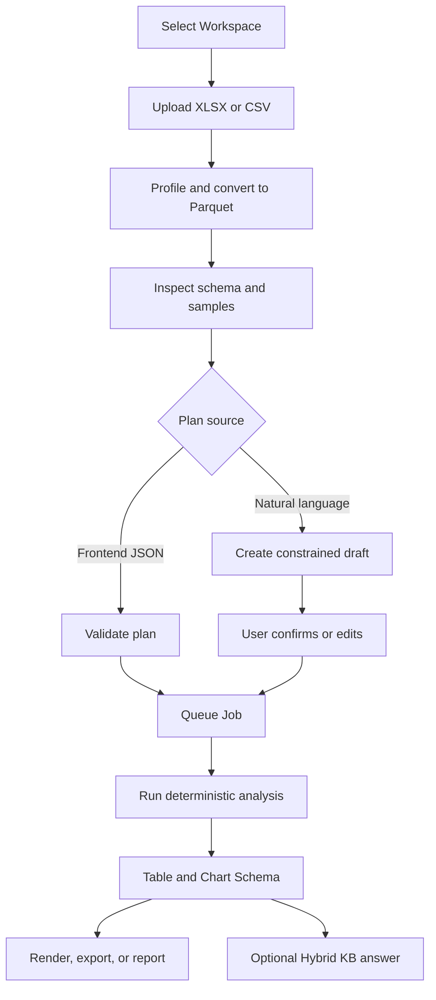

# Session Attachments and Persistent Spreadsheet Workspace

> Branch: `codex/session-analysis-workspace`<br>
> API version: `0.12.0`<br>
> Updated: 2026-07-30<br>
> Frontend implementation guide:
> [Frontend_File_Upload_Guide.md](Frontend_File_Upload_Guide.md)

This feature separates temporary chat documents from deterministic spreadsheet
analysis. It is designed for an internal 31B non-reasoning LLM: the backend owns
workflow control and calculations, while the model only answers grounded document
questions or explains already-computed results.

## Processing modes

| Input | Route | Processing | LLM role |
|---|---|---|---|
| PDF, DOCX, PPTX, image, text | `POST /api/v1/documents/upload` with `scope=session` | Existing document worker converts to Markdown, chunks, embeds, and indexes only for the session | Answer from retrieved chunks |
| XLSX or CSV for exact analysis | `POST /api/v1/analysis/files/upload` | Stored under a persistent Workspace; no chunks or embeddings are created | Optional explanation after calculation |

Large spreadsheets must use the analysis route. They are not inserted into the
knowledge base and are not treated as RAG documents.

## Session attachment chat

`POST /api/v1/chat/query` and `POST /api/v1/chat/stream` accept:

```json
{
  "session_id": "SESSION_UUID",
  "query": "Compare the two attached reports.",
  "knowledge_base_ids": [],
  "attachment_ids": ["DOCUMENT_UUID_1", "DOCUMENT_UUID_2"],
  "retrieval_scope": "attachments_only",
  "top_k": 8,
  "use_rerank": true,
  "use_tools": false
}
```

Retrieval scopes:

| Value | Meaning |
|---|---|
| `auto` | Preserve existing behavior; explicit attachments select attachment-only retrieval |
| `attachments_only` | Retrieve only the listed `attachment_ids` |
| `session_attachments` | Retrieve all ready RAG documents in the session |
| `knowledge_bases_only` | Retrieve only the listed knowledge bases |
| `session_and_knowledge_bases` | Combine session documents and authorized knowledge bases |

The backend validates that every attachment belongs to the same session, is ready,
and is readable by the current principal. Session attachment management routes are:

- `GET /api/v1/chat/sessions/{session_id}/attachments`
- `DELETE /api/v1/chat/sessions/{session_id}/attachments/{document_id}`

`knowledge_base_ids` and `attachment_ids` each accept at most 20 UUIDs. A frontend
uploading multiple files into a new Session must upload the first file, save the
returned `session_id`, and use it for subsequent uploads. Parallel uploads without
a `session_id` create separate Sessions.

## Workspace ownership model

`Workspace` is the persistent owner of spreadsheet files, profiles, jobs, results,
and export artifacts. A Chat Session is only an optional interaction origin.

```text
Workspace
├── Chat Sessions
├── Analysis Files
│   ├── original
│   └── profile
├── Analysis Jobs
│   └── results
└── Artifacts
```

When the compatible upload route receives only `session_id`, the backend creates
or reuses that user's private Workspace and links the Session to it. Supplying
`workspace_id` uploads directly into an existing Workspace after write permission
is checked.

Workspace permissions support `user`, `department`, `role`, and `project`
subjects with `read`, `write`, or `admin` levels. File confidentiality clearance
is checked in addition to Workspace membership.

### Workspace routes

| Method | Route | Purpose |
|---|---|---|
| POST | `/api/v1/workspaces` | Create a Workspace |
| GET | `/api/v1/workspaces` | List accessible Workspaces |
| GET | `/api/v1/workspaces/{workspace_id}` | Get Workspace metadata and counts |
| PATCH | `/api/v1/workspaces/{workspace_id}` | Update Workspace metadata |
| DELETE | `/api/v1/workspaces/{workspace_id}` | Delete the Workspace and its stored data |
| PUT | `/api/v1/workspaces/{workspace_id}/sessions/{session_id}` | Link or move a Session |
| DELETE | `/api/v1/workspaces/{workspace_id}/sessions/{session_id}` | Detach a Session |
| POST | `/api/v1/workspaces/{workspace_id}/permissions` | Create or update sharing permission |
| GET | `/api/v1/workspaces/{workspace_id}/permissions` | List sharing permissions |
| DELETE | `/api/v1/workspaces/{workspace_id}/permissions/{permission_id}` | Remove sharing permission |
| GET | `/api/v1/workspaces/{workspace_id}/artifacts` | List export artifact metadata |

## Spreadsheet analysis workflow



The paths after inspection are alternatives. A direct frontend plan uses
`plans/validate` and then `POST /analysis/jobs`. A natural-language plan uses
`plan-drafts` and `plan-drafts/{draft_id}/confirm`; the confirmation request itself
creates and returns the queued Job, so the frontend must not create a second Job.

### Routes

| Method | Route | Purpose |
|---|---|---|
| POST | `/api/v1/analysis/files/upload` | Stream an XLSX/CSV; accepts `session_id`, or `workspace_id` without a Session |
| GET | `/api/v1/analysis/files?workspace_id=...` | List files directly by Workspace |
| GET | `/api/v1/analysis/files?session_id=...` | Compatible route; resolves the Session's Workspace |
| GET | `/api/v1/analysis/files/{file_id}` | Poll profile status, progress, errors, and dataset count |
| GET | `/api/v1/analysis/files/{file_id}/inspect` | Return workbook schema and samples |
| POST | `/api/v1/analysis/files/{file_id}/profile/retry` | Queue preprocessing again |
| DELETE | `/api/v1/analysis/files/{file_id}` | Delete file and jobs |
| POST | `/api/v1/analysis/plans/validate` | Validate and normalize a whitelist plan |
| POST | `/api/v1/analysis/plan-drafts` | Natural language to a constrained, validated draft |
| GET | `/api/v1/analysis/plan-drafts/{draft_id}` | Read a draft and validation warnings |
| POST | `/api/v1/analysis/plan-drafts/{draft_id}/confirm` | Confirm a draft and queue its Job |
| POST | `/api/v1/analysis/jobs` | Queue an analysis job |
| GET | `/api/v1/analysis/jobs?workspace_id=...` | List and filter paginated jobs for a Workspace |
| GET | `/api/v1/analysis/jobs?session_id=...` | Compatible route; resolves the Session's Workspace |
| GET | `/api/v1/analysis/jobs/{job_id}` | Return status and structured result |
| POST | `/api/v1/analysis/jobs/{job_id}/cancel` | Cancel a queued or running job |
| POST | `/api/v1/analysis/jobs/{job_id}/retry` | Queue a new attempt for a failed or cancelled job |
| POST | `/api/v1/analysis/jobs/{job_id}/explain` | Ask the LLM to explain a completed result |
| POST | `/api/v1/analysis/hybrid-answer` | Combine completed results with authorized KB evidence |
| POST | `/api/v1/analysis/jobs/{job_id}/export` | Save CSV, JSON, or Parquet export |
| POST | `/api/v1/analysis/jobs/{job_id}/reports` | Save a Markdown report |
| POST | `/api/v1/analysis/jobs/{job_id}/charts` | Save a versioned Chart Schema artifact |
| GET | `/api/v1/workspaces/{workspace_id}/artifacts/{artifact_id}` | Read artifact metadata |
| GET | `/api/v1/workspaces/{workspace_id}/artifacts/{artifact_id}/download` | Download an artifact |

### Supported deterministic operations

- Select columns
- Filter: `eq`, `ne`, `gt`, `gte`, `lt`, `lte`, `contains`, `in`,
  `is_null`, `not_null`
- Group by up to five columns
- Aggregate: `count`, `distinct_count`, `sum`, `mean`, sample `std`, `min`,
  `max`, `count_if`, `percentile`
- Sort aggregated output
- Generate bar, line, or scatter chart payloads
- Join up to eight preprocessed Sheets/files with explicit keys
- Date buckets: day, week, month, quarter, year
- Distinct count and percentile
- Pivot/cross table
- Pearson or Spearman correlation matrix

The backend never executes model-generated Python, SQL, or JavaScript. Unknown columns,
incompatible numeric operations, unsupported output fields, oversized row counts,
and excessive group counts are rejected before or during execution.

Every aggregation alias must be unique and must not collide with a `group_by`
column name. The API rejects these collisions before plan execution. Filter
operators other than `is_null` and `not_null` must include a value.

Raw extraction summaries report the complete number of matched rows in
`summary.result_rows`, even when `limit` or `ANALYSIS_RESULT_MAX_ROWS` truncates
the returned table. `summary.truncated` is therefore reliable for both raw and
aggregated results.

### XLSX formulas and formats

Inspection returns additive `warnings` fields at response and sheet level. The
sheet payload also includes `formula_cells_in_sample` and
`formatted_cells_in_sample`.

- Formula cells use the cached value last saved by Excel. The backend does not
  recalculate formulas.
- A formula with no cached value is returned as null and produces a warning.
- Date, percentage, number, and leading-zero display formats are not preserved in
  result JSON; calculations use the underlying cell value.

These counts cover the configured inspection sample, not the complete workbook.
Recalculate and save workbooks in Excel before analysis when formulas are used.

### Example plan

```json
{
  "file_id": "FILE_UUID",
  "plan": {
    "sheet": "Production",
    "group_by": ["Machine"],
    "aggregations": [
      {"function": "count", "alias": "sample_count"},
      {"function": "mean", "column": "Yield", "alias": "mean_yield"},
      {"function": "std", "column": "Yield", "alias": "std_yield"},
      {
        "function": "count_if",
        "alias": "below_95",
        "condition": {"column": "Yield", "operator": "lt", "value": 95}
      }
    ],
    "sort": [{"column": "mean_yield", "direction": "asc"}],
    "limit": 1000,
    "charts": [
      {
        "type": "bar",
        "x_field": "Machine",
        "y_field": "mean_yield",
        "title": "Average yield by machine"
      }
    ]
  }
}
```

## Worker and safety model

The analysis API only stores files and queues database jobs. The dedicated worker
claims jobs using PostgreSQL row locking and executes spreadsheet processing in a
killable child process with a configured timeout. This avoids blocking Uvicorn and
allows multiple worker processes without claiming the same job.

Job progress is intentionally coarse in this phase: `0` while queued, `5` when
claimed, `10` while the spreadsheet subprocess is running, and `100` when completed
or failed. Cancelling a running job updates the database immediately and the worker
terminates its child process on the next cancellation poll. Retry creates a new job
with `retry_of_job_id`; it never mutates or erases the original attempt.

Legacy chart payloads use `schema_version: "1.0"`; advanced dataset plans use
`schema_version: "2.0"` and can add `series_field`, `x_type`, `y_unit`,
`decimal_places`, `tooltip_fields`, and `zoom`. Both retain the compatible
`type`, `title`, `x_field`, `y_field`, and `data` fields. The frontend loads a
local ECharts runtime and `frontend/echarts-adapter.js`, which turns only the
approved bar, line, and scatter payloads into ECharts options. No model-generated
JavaScript is evaluated.

The LLM explanation endpoint receives only bounded result JSON. Its fixed prompt
states that calculations are final, numbers must not be changed, and causal claims
must not be invented. DLP masking and the shared LLM concurrency limiter are applied.
No autonomous tool planning is required from the 31B model. Natural-language
planning is a two-step operation: the model emits JSON, the backend validates it
against actual Parquet schemas, and the user must call `confirm` before a Job
exists. A draft cannot execute Python, SQL, JavaScript, or arbitrary tool calls.

## Preprocessing and query engines

New uploads return `status=profile_queued`. The dedicated analysis worker claims
profile tasks before analysis Jobs:

```text
original XLSX/CSV
  -> read-only streaming extraction
  -> DuckDB CSV inference / Parquet conversion
  -> Polars lazy schema and null profiling
  -> profile.json + dataset_manifest
  -> status=ready
```

Each XLSX Sheet becomes a separate Parquet dataset. CSV becomes one `CSV`
dataset. Original files remain unchanged. Formula values still use the cache last
saved by Excel and VBA is never executed.

Advanced Jobs read only server-created `dataset_manifest` paths. User or model
text cannot supply filesystem paths. Column references, Join keys, aggregations,
output fields, row/group limits, chart points, and export rows are validated.

## Hybrid answer boundary

`POST /api/v1/analysis/hybrid-answer` accepts completed `analysis_job_ids` and
authorized `knowledge_base_ids`. The prompt separates them into:

- `COMPUTED_ANALYSIS_FACTS`: immutable backend calculation results.
- `KNOWLEDGE_BASE_EVIDENCE`: permission-filtered RAG chunks.

The LLM cites an Analysis Job for numeric observations and `[Source N]` for
document explanations. It may not turn a general SOP statement into a causal
claim about the spreadsheet. DLP and Workspace/KB permissions are applied before
context reaches the LLM.

## Cross-Session reuse

`AnalysisJobCreate` accepts an optional `session_id`. A Session linked to the same
Workspace can create a new job using an existing `file_id`; the original upload is
not copied or reparsed. Shared users may also create Workspace jobs without a
Session when they have write permission.

Deleting a Chat Session detaches `analysis_files.session_id` and
`analysis_jobs.session_id`. It does not delete the Workspace file, result, or
artifact. Deleting the Workspace is the explicit destructive operation.

## Storage layout

```text
local_storage_root/
└── workspaces/{workspace_id}/
    ├── files/{file_id}/
    │   ├── original/{filename}
    │   ├── profile/profile.json
    │   ├── datasets/{sheet_key}.parquet
    │   └── metadata.json
    ├── jobs/{job_id}/
    │   └── results/result.json
    └── artifacts/{artifact_id}/{filename}
```

All path components are validated against the configured Workspace root.
`result_json` remains in PostgreSQL for polling compatibility, while the same
result is also persisted in the results layer.

## Retention and migration

New Workspace files are persistent by default (`expires_at = null`). The cleanup
worker still removes legacy rows with an explicit expiry, except files with a
running job. Session-scoped RAG documents retain their existing lifecycle.

After deployment, run:

```bash
python -m app.db.init_db
```

The additive phase-two migration creates private Workspaces for existing users,
links existing Sessions, backfills `workspace_id`, clears legacy spreadsheet
expiry, and changes Session foreign keys to `ON DELETE SET NULL`. The phase-three
and phase-four migration adds dataset manifests, profiling state, plan drafts,
artifact metadata, and result paths without removing the compatible Session APIs.
